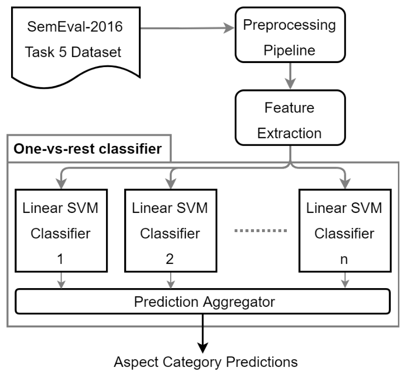
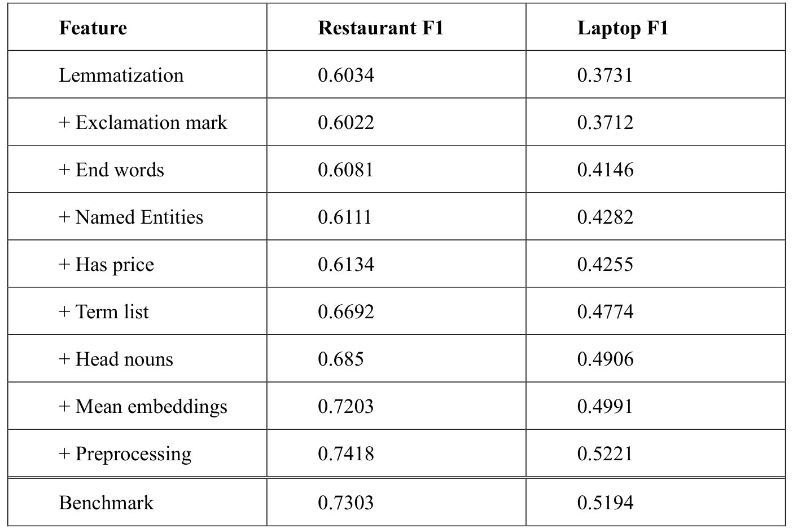

## TL;DR
A one-vs-rest linear SVM with a careful preprocessing pipeline (including **context-sensitive spell correction**) and new features (**mean word2vec embeddings, per-phrase head nouns, named entities**) beats the best SemEval-2016 Task 5 system on both domains: **74.18 F1 on restaurants and 52.21 on laptops** (vs. 73.03 / 51.94).

## Problem
Aspect-based sentiment analysis has to find every aspect category in a review sentence, including implicit ones, across domains with many classes (81 for laptops). The top SemEval-2016 system was a complex CNN + feed-forward hybrid. The question: can a simple SVM with well-chosen features beat it?

## Approach
- **Preprocessing** (Fig. 1): remove HTML, fix encoding, normalize elongated words ("sooooo"), apply **context-sensitive spell correction** (Bing Spell Check), expand contractions, map symbols to words, add a price-indicator token, remove articles.
- **Features**: lemmatized bag of words (CoreNLP); custom food, drink and laptop word lists; opinion-target annotations; per-category tf-idf frequent words; price and "!" presence; last five words; plus three new ones:
  - **NER tags** as direct features;
  - **head nouns for every phrase** (rightmost noun), not one per sentence, so several aspects can be captured;
  - **mean word2vec embedding** (Google News).
- **Classifier:** one-vs-rest linear SVM (12 classifiers for restaurants, 81 for laptops), tuned by cross-validation.

*Fig. 1: SemEval-2016 data → preprocessing → feature extraction → one-vs-rest linear SVMs → prediction aggregation → aspect predictions.*

## Key results
- **Ablation (Table 1):** F1 for restaurants / laptops climbs from 60.34 / 37.31 (lemmas only) through the features. **Mean embeddings** give the biggest single jump on restaurants (68.5 → 72.03). **Preprocessing** adds the final gain to **74.18 / 52.21**.
- **Beats the SemEval-2016 best** (NLANGP, 73.03 / 51.94) in both domains.
- Context-sensitive vs. isolated-word spell correction: 72.88 → 74.18 F1 on restaurants.

*Table 1: Cumulative feature ablation vs. the SemEval-2016 benchmark.*

## Contributions
1. An effective SVM aspect classifier that beats the state of the art.
2. A preprocessing pipeline with context-sensitive spell correction (not previously used for this task).
3. New features (mean embeddings, per-phrase head nouns, NER as features). All features except the custom word lists adapt automatically to new domains.
