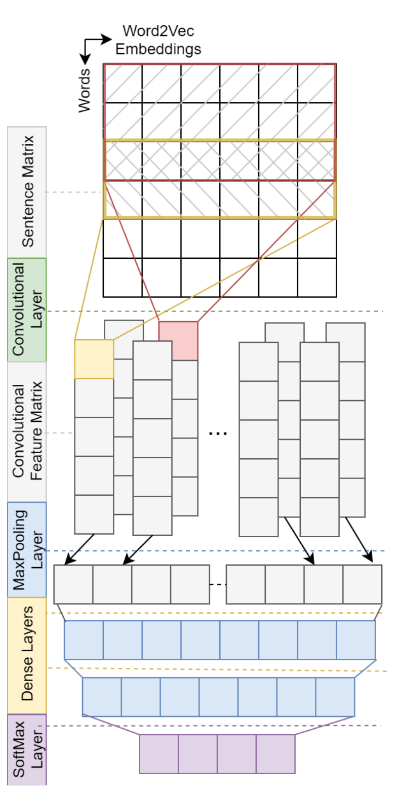
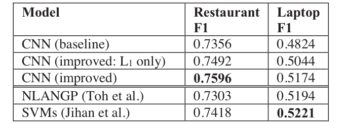

## TL;DR
An improved CNN for aspect-category extraction adds multi-kernel convolutions (3, 5), dropout, two theory-sized hidden layers and non-static Google word2vec. It reaches **75.96 F1 on restaurants, the best at the time**, beating both the SemEval-2016 winner (73.03) and the SVM from Jihan et al. 2017 (74.18). On laptops it scores 51.74, just below those benchmarks.

## Problem
CNNs for aspect extraction had not adopted improvements known to help general text classification: non-static embeddings, multiple kernel sizes, dropout and optimized dense layers. The effect of CBOW vs. skip-gram initialization was also unstudied.

## Approach
- **Baseline CNN** (after Toh et al.): one kernel of width 5 and one hidden layer of 100 units (Table 1).
- **Improved CNN** (Fig. 1, Table 2): kernels of 3 and 5 with 300 filters each, dropout 0.7, and two hidden layers sized by Huang et al.'s formula (191/143 units for restaurants, 467/445 for laptops). Adam optimizer, 5-fold CV, threshold 0.2.
- **Embeddings:** CBOW and skip-gram trained on Yelp and Amazon reviews vs. Google News word2vec, each static and non-static.

*Fig. 1: Word2vec sentence matrix → multi-kernel convolution → max pooling → two dense layers → softmax.*

## Key results
- **Embeddings** (Figs. 2–3): skip-gram beats CBOW and Google word2vec beats both. Non-static beats static, especially on laptops (49.30 → 51.74).
- **Table 3, F1 for restaurants / laptops:**
  - CNN baseline 73.56 / 48.24.
  - Improved CNN with one hidden layer 74.92 / 50.44.
  - **Improved CNN 75.96 / 51.74.**
  - NLANGP (Toh et al.) 73.03 / 51.94; SVMs (Jihan et al.) 74.18 / 52.21.
- On laptops the CNN does not beat the benchmarks. Likely reasons: no domain-specific features, 81 classes with 2,500 examples, and class imbalance.
- The same hyperparameters work in both domains, apart from the formula-derived layer sizes.

*Table 3: F1 of the CNN variants vs. NLANGP and the SVMs.*

## Contributions
1. An improved CNN architecture for aspect extraction: multi-kernel convolutions, dropout, and two hidden layers.
2. Evidence that skip-gram embeddings beat CBOW, and that non-static fine-tuning helps when no domain corpus is available.
3. State-of-the-art restaurant F1 without domain-specific hyperparameter tuning.
