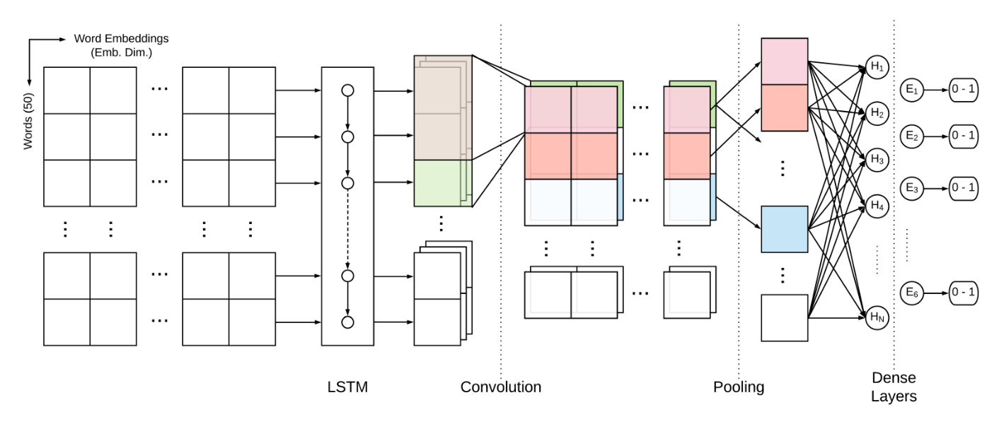
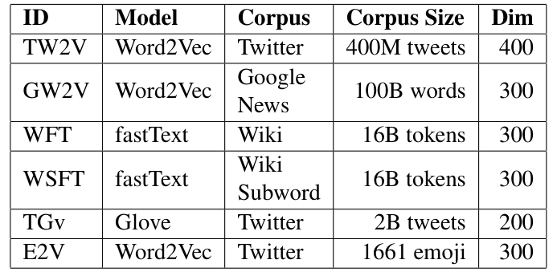

## TL;DR
A shared-task system that trains an LSTM-CNN on each of several pre-trained embeddings, then stacks their learned features into a feed-forward classifier. It reached **68.1 macro-F1**, beating the baseline by about 8 points and **ranking 8th** in the WASSA-2018 Implicit Emotion Shared Task, without external corpora or lexicons.

## Problem
In implicit emotion, the emotion is expressed without the emotion word itself. Tweets are informal and full of emoji, which makes this hard. IEST 2018 replaced the trigger emotion word with a placeholder and asked systems to predict 1 of 6 emotions: anger, sad, joy, fear, disgust, surprise.

## Approach
- **Preprocessing:** NLTK TweetTokenizer; the trigger placeholder and newline tokens normalized.
- **Six pre-trained embeddings** (Table 1): Twitter word2vec (TW2V), Google News word2vec (GW2V), Wiki fastText with and without subwords (WFT/WSFT), Twitter GloVe (TGv), and emoji2vec (E2V) as an extension to GW2V.
- **Stage 1, LSTM-CNN** (Fig. 1, Table 2): an LSTM (250 units) feeding a CNN (350 filters, kernels 2/3/5), max pooling, dense layer (50, ReLU), softmax over 6 classes. One model is trained per embedding.
- **Stage 2, FNN** (Fig. 2, Table 3): the dense-layer features of the best LSTM-CNN models are concatenated and fed to a 2-hidden-layer feed-forward network (50 and 25 units).
- Hyperparameters tuned manually and with Tree of Parzen Estimators (Hyperopt); Keras/TensorFlow.

*Fig. 1: Word embeddings → LSTM → convolution → pooling → dense layers → 6-way output.*

*Table 1: Pre-trained embeddings compared.*

## Key results
- Every single-embedding LSTM-CNN beats the baseline (59.8 test F1). The best is **Twitter word2vec at 67.0 test macro-F1** (Table 4), likely because of in-domain vocabulary.
- **Emoji help:** adding emoji2vec lifts GW2V from 63.8 to 65.2 test F1.
- Subword information did not help: WFT 65.2 vs. WSFT 62.5.
- **Stacked FNN best: 68.3 P / 68.1 R / 68.1 macro-F1**, using features from the TW2V, E2V and WFT models (Table 5). The shared-task winner scored 71.45.
- **Ranked 8th** in IEST @ WASSA-2018.

## Contributions
1. A sequential LSTM-CNN feature extractor combined with an FNN classifier for implicit emotion.
2. Evidence that features from multiple pre-trained embeddings can be combined to improve classification.
3. Evidence that in-domain (Twitter) and emoji embeddings matter most.

## Limitations
- Architectures were not tuned per embedding.
- Hyperparameter search was limited by compute and time.
