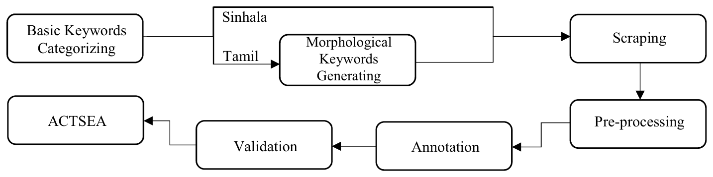
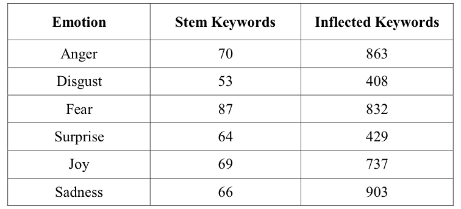

## TL;DR
The **first emotion corpus for Tamil and Sinhala**: **600k Tamil and 318k Sinhala tweets**, collected semi-automatically with emotion keywords expanded by a **morphological generator** (400–900 inflected forms per emotion). A 3,000-tweet annotated sample shows strong inter-annotator agreement for Tamil (κ 0.76–0.91) and moderate agreement for Sinhala (κ 0.55–0.72).

## Problem
Tamil and Sinhala, spoken by about 100 million people, had no annotated emotion corpora. Manual corpus creation is too expensive for low-resource languages. Existing semi-automatic methods (Mohammad et al.) don't handle **morphological richness**: English needs 60–100 keywords per emotion, while these languages need hundreds of inflections.

## Approach
- **Keywords:** linguists chose stem emotion keywords for six emotions (anger, disgust, fear, joy, sadness, surprise). A **morphological generator** expanded them, for example anger from 70 stems to 863 inflected keywords (Table I).
- **Collection** (Fig. 1): month-by-month scraping of all 2018 tweets matching the keywords, followed by deduplication and cleaning (hashtags, mentions and URLs removed, other-language sentences dropped).
- **Annotation:** a sampling approach with native-speaker annotators. Labels are **Correctly Classified**, **Misclassified** (emotional but a different emotion), **Objective** (no emotion) and **Not Applicable**. Two annotators plus a validator (Tables II–IV).
- **Sample:** 300 tweets per emotion for Tamil and 200 for Sinhala, 3,000 in total.

*Fig. 1: Basic keyword categorization → morphological keyword generation (Sinhala/Tamil) → scraping → preprocessing → annotation → validation → ACTSEA.*

*Table I: Stem vs. inflected keywords per emotion, showing the effect of morphology.*

## Key results
- **Corpus size:** 600,280 Tamil and 318,308 Sinhala tweets, the largest collection for these languages at the time.
- **Annotated sample** (Table V): 543 objective and 945 uncertain tweets removed. The paper reports that 1,962 correctly classified and misclassified tweets remain.
- **Agreement:** Cohen's κ for Tamil is 0.76–0.91; for Sinhala it is 0.55–0.72, with sadness lowest (0.55) (Table V).
- **Purity:** on average **25.45%** of keyword-collected tweets are correctly classified. For Sinhala, misclassified tweets outnumber correct ones, likely because of negation, news headlines and mixed emotions.

## Contributions
1. A language- and topic-independent semi-automatic corpus generator.
2. Primary emotion keywords and their morphological variants for Tamil and Sinhala.
3. A morphological keyword generator.
4. ACTSEA, the first public emotion-annotated corpus for Tamil and Sinhala.
