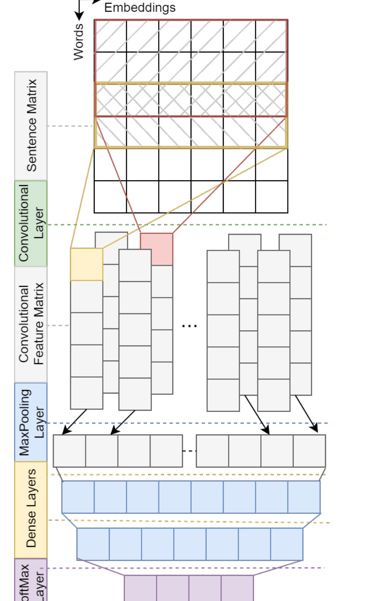
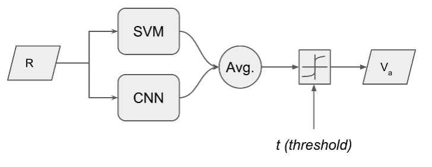

## TL;DR
An improved CNN for aspect-category detection uses multiple kernel sizes, dropout, two theory-sized hidden layers and non-static Google word2vec. Averaging its probabilities with a feature-engineered SVM gives **77.17 F1 on restaurants and 54.54 on laptops** (SemEval-2016 Task 5), beating the prior state of the art (MTNA at 76.42; SVM at 52.21).

## Problem
Aspect extraction is a multi-label task: a single review can mention several aspects. Existing CNNs for it did not use known improvements (multi-kernel convolutions, non-static embeddings, optimized dense layers) and miss context-level features. No comparison of CBOW vs. skip-gram initialization existed for this task.

## Approach
- **Baseline CNN** (after Toh et al., the top SemEval-2016 system): one kernel (window 5) and a single 100-unit hidden layer (Table I).
- **Improved CNN** (Fig. 1, Table II):
  - kernels of sizes 3 and 5 (300 filters each) to capture multi-length context, plus dropout 0.7;
  - **two hidden layers sized by Huang et al.'s constructive formula** (191/143 units for restaurants, 467/445 for laptops), Eqs. 1–2;
  - non-static (fine-tuned) word2vec; Adam optimizer; 5-fold CV.
- **Embeddings compared:** CBOW and skip-gram trained on Yelp and Amazon reviews vs. Google News word2vec.
- **SVM** (from Jihan et al.): one-vs-rest over engineered features (lemmatized BoW, domain word lists, tf-idf frequent words, opinion targets, price and "!" symbols, ending words, named entities, head nouns, mean embeddings).
- **Mixture of classifiers:** average the CNN and SVM probabilities, then threshold (t = 0.3) (Eq. 3, Fig. 4).

*Fig. 1: Sentence matrix → multi-kernel convolution → max pooling → two dense layers → softmax.*

*Fig. 4: SVM and CNN probabilities averaged and thresholded into the aspect vector.*

## Key results
- **Embeddings (Table III):** skip-gram beats CBOW, and Google word2vec beats both. Non-static beats static everywhere, especially on laptops (49.30 → 51.74 F1).
- **Model comparison (Table IV), F1 for restaurants / laptops:**
  - CNN baseline 73.56 / 48.24 → CNN (improved, 1 hidden layer) 74.92 / 50.44 → CNN (improved) **75.96 / 51.74**.
  - SVM (Jihan et al.) 74.18 / 52.21; NLANGP (Toh et al.) 73.03 / 51.94; MTNA 76.42 / –.
  - **Hybrid model: 77.17 / 54.54**, best in both domains.
- The CNN alone beats Toh et al. and the SVM on restaurants but not on laptops, where domain-specific features help. The hybrid fixes this.
- The same hyperparameters work across both domains with no domain-specific tuning.

## Contributions
1. A modified CNN for aspect extraction with multi-kernel convolutions and dropout.
2. Two hidden dense layers sized by Huang et al.'s constructive method, the first use of this for aspect extraction.
3. A comparative study of CBOW vs. skip-gram initialization.
4. Evidence that non-static CNNs help when no domain-specific embeddings are available.
5. A CNN + SVM mixture of classifiers that outperforms the state of the art.

## Future work
- Attention-based architectures.
- Embeddings that capture both general and domain-specific information.
- Testing whether the hyperparameters transfer across more domains.
