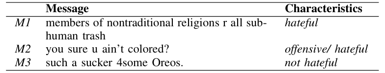
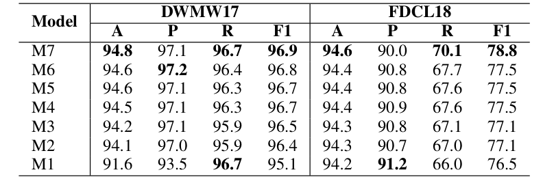

## TL;DR
An empirical study combining three kinds of semantics for binary hate/offensive tweet detection: corpus-based (tf-idf), declarative knowledge (Hatebase and FrameNet) and distributional (word2vec). The hybrid representation beats tf-idf alone on two Twitter datasets and **generalizes much better across datasets** (F1 39.6 → 56.8 and 78.9 → 88.6).

## Problem
Hate intent is subtle: sarcasm, anger and hate are hard to separate, and context is hard to represent. Prior work explored many feature types but used **knowledge-base features** little, with no systematic study of how different semantic representations combine.

## Approach
- **Task:** binary classification of hate or offensive vs. normal. DWMW17 (hate + offensive → hate) and FDCL18 (abusive + hateful → hate; spam + normal → normal) (Table II).
- **Features**:
  - *Corpus semantics:* tf-idf with 1–3-grams (baseline M1).
  - *Declarative knowledge from Hatebase:* offensiveness score (binned), an unambiguous flag, and bag-of-words over hateful and non-hateful definitions of each hate term.
  - *FrameNet:* frames from the SLING parser (PropBank frames mapped to FrameNet), as frame-count vectors.
  - *Distributional semantics:* mean of 300-d word2vec embeddings.
- **Model:** linear SVM (L2, C = 1.0); incremental schemes M1 → M7 add one feature group at a time; 5-fold stratified CV.

*Table I: Why context matters: hateful, implicitly offensive, and angry-but-not-hateful posts.*

## Key results
- **Best scheme M7 (all features):** DWMW17 **F1 96.9** (vs. M1 95.1); FDCL18 **F1 78.8** (vs. 76.5) (Table III).
- Knowledge-base features (Hatebase, FrameNet) mainly raise **precision**: DWMW17 P 93.5 → 97.2 for M6.
- **Cross-dataset generalization** (Table IV): train DWMW17 → test FDCL18, F1 **39.6 → 56.8**; train FDCL18 → test DWMW17, F1 **78.9 → 88.6**. tf-idf alone does not transfer across datasets.
- Error analysis (Table V) shows the remaining failures need discourse context (e.g., the relationship between speaker and receiver).

*Table III: Accuracy, precision, recall and F1 for schemes M1–M7 on both datasets.*

## Contributions
1. An extensive empirical evaluation of diverse semantic feature representations (corpus, knowledge-base, distributional) for hate speech detection.
2. Evidence that combining them improves performance (claimed absolute F1 gain of up to 3.0%).

## Limitations & future work
- Polysemy is only partly handled; contextual word-sense disambiguation is needed.
- English only, so multilingual extension is future work. Discourse features (speaker–receiver relationship) are also future work.
