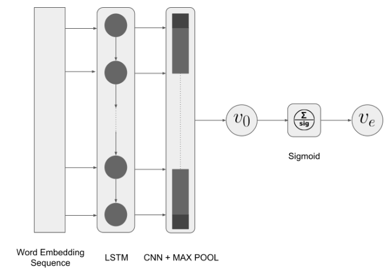
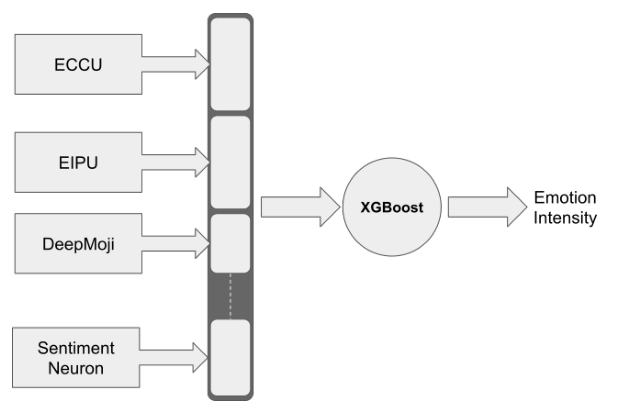

## TL;DR
An LSTM-CNN that **slightly beats the SemEval-2018 benchmark on multi-label emotion classification** (Jaccard 58.63 vs. 57.88). For intensity regression, features transferred from several pre-trained models into XGBoost reach **0.798 average Pearson**, essentially tied with the top system (0.799) and best on fear and sadness. Deep SHAP heat-maps show which words and emoji drive each prediction.

## Problem
Emotion analysis usually stops at classification, but emotions vary in intensity. Labeled intensity data is scarce, and deep emotion models are rarely explained; attention weights give only a partial view.

## Approach
- **Data:** SemEval-2018 Affect in Tweets. E-c has 11 emotions, multi-label, 10,983 tweets. EI-reg has per-emotion intensity for anger, fear, joy and sadness, about 3k tweets each (Table 1).
- **ECCU** (classification; Fig. 1): Twitter word2vec (frozen) → LSTM → CNN → max pooling → sigmoid. **EIPU** (intensity) uses the same design with a single output (Table 2).
- **EITL** (transfer learning for intensity; Fig. 2): concatenates features from ECCU, EIPU, **DeepMoji** and the **OpenAI sentiment neuron**, then trains an XGBoost regressor per emotion (Table 3).
- **Explanations:** Deep SHAP values normalized per tweet and rendered as word-level heat-maps (Eq. 2, Table 6).
- Preprocessing with ekphrasis (spell correction, segmentation).

*Fig. 1: Embeddings → LSTM → CNN with max pooling → sigmoid emotion vector.*

*Fig. 2: ECCU, EIPU, DeepMoji and sentiment-neuron features → XGBoost → intensity.*

## Key results
- **Classification (Table 5):** ECCU scores **Jaccard 58.63, micro-F1 71.92, macro-F1 52.8**, vs. NTUA-SLP 57.88 / 70.1 / 52.8, the benchmark the paper uses.
- **Intensity (Table 4), Pearson r:**
  - EITL averages **79.81%** vs. SeerNet 79.90% (state of the art) and NTUA-SLP 77.70%.
  - Per emotion: fear **78.67** (vs. 77.90) and sadness **79.99** (vs. 79.80) beat SeerNet; anger is 82.16 vs. 82.70 and joy 78.42 vs. 79.20.
  - EIPU alone reaches 70.83 avg, well above the BoW/NBoW baselines (52–64).
- **Explanations (Table 6):** keywords and emoji dominate the predictions, and the model takes context into account.

## Contributions
1. Simpler but effective models for emotion classification and intensity prediction.
2. Applying state-of-the-art interpretation (Deep SHAP) to visualize and explain deep emotion-intensity models.

## Future work
- Attention mechanisms (Transformers) to improve intensity prediction.
