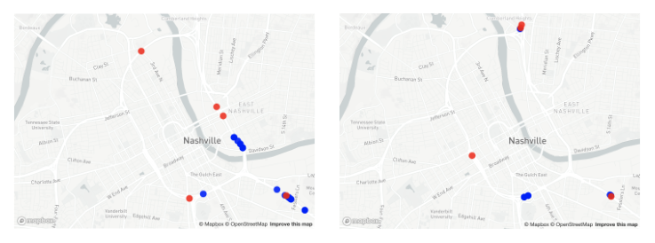
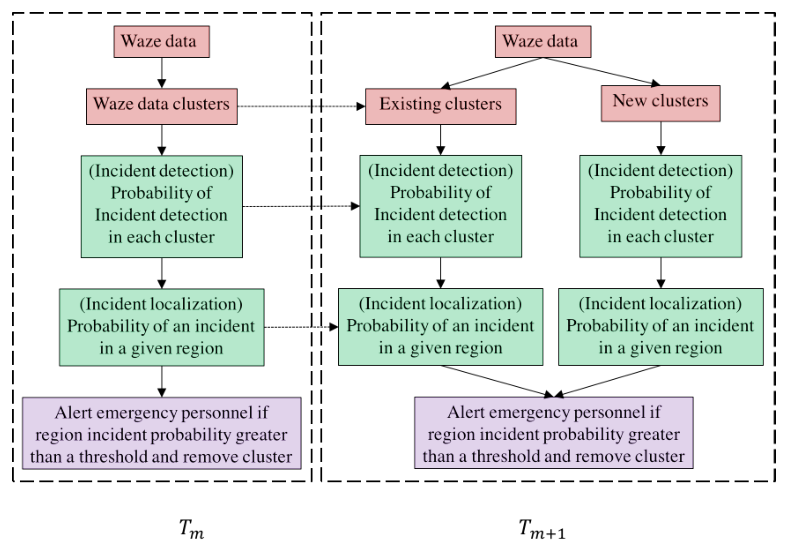

## TL;DR
A principled Bayesian framework that fuses noisy, redundant crowdsourced Waze reports across space and time to detect and localize traffic accidents. On Nashville data it beats count/reliability baselines in F1 and AUC, and on average flags accidents **5.92 minutes before** the official record.

## Problem
Emergency services are *reactive*: they wait for 911 calls. Crowdsourced platforms like Waze offer a *proactive* signal, but reports are **unreliable** (variable user credibility), **spatio-temporally uncertain** (people report after driving past), and **redundant** (many reports per incident; Fig. 1). Prior work used simple aggregation (counts or averages) of surface features with no principled treatment of uncertainty, and did not analyze the effect of spatio-temporal resolution.

**Framing:** humans act as unreliable sensors and accidents act as faults, which makes this an analogue of fault diagnostics in cyber-physical systems.

*Fig. 1: Waze reports (blue) vs. actual incidents (red) in the same region at two different times, which shows the fusion challenge.*

## Approach
1. **Spatio-temporal discretization:** H3 hexagonal grid regions; fixed time steps (Fig. 3).
2. **Grouping reports to incidents:** *segmentation* (collect all reports in a region over the incident period) vs. *DBSCAN clustering* on location and time (best ε = 0.8, silhouette 0.8156).
3. **Incident detection:** Naive Bayes posterior P(incident | reports), treating each report's reliability/10 as its true-positive probability; priors from historical E-TRIMS counts per region and hour (Eqs. 2–5).
4. **Incident localization:** each report covers a circle of radius δ = v·t_r (reporter speed × reaction time); the likelihood is proportional to its area overlap with each region (Eqs. 6–8).
5. **Sequential updating:** the posterior at step m becomes the prior at m+1; new reports join existing clusters or start new ones (Sec. IV-G).
6. **Alert decision:** logistic regression / random forest learns the probability threshold against E-TRIMS ground truth (Sec. IV-H).

*Fig. 3: Pipeline across time steps T_m → T_m+1. Red boxes are data and clustering, green are detection and localization, purple is the alert decision.*

## Key results
- **Evaluation:** 5-fold CV; Oct–Dec 2019; 33,218 Waze reports, 2,878 E-TRIMS incidents.
- **Best hyperparameters:** incident period T′ = 25 min, time step = 1 min, δ = 100 m, H3 resolution 6.
- **Best F1: 48%** (M6, segmentation-based plausibility + logistic regression) vs. **45%** for the best baseline (M2). **Best AUC: 71%** (M7/M8, all features, clustering) vs. **65%** baseline (Table II).
- The conclusion reports a **relative F1 gain of over 5%** against baselines.
- Clustering gives higher precision but lower recall; the random-forest baseline has the highest recall (78%) but low precision.
- **Early detection:** the best model (M6) flags accidents on average **5.92 min before** the official E-TRIMS record. In the case study (Fig. 8), Waze reports arrive 12 min before the official record.

## Contributions
1. A novel Bayesian-theoretic method for spatio-temporal fusion of noisy crowdsourced reports, with uncertainty quantified as calibrated probabilities (confidence per prediction).
2. Sequential updating of incident probabilities as new reports arrive (real-time).
3. Analysis of how spatio-temporal resolution affects detection.
4. An extensible framework for other noisy crowdsourced sources.

## Limitations & future work
- Matching crowdsourced reports to formal records is hard because of human error and reporting delays.
- Assumes constant reporter speed and independent reports.
- Future work: automated feature extraction and fusion; road-segment fidelity instead of regional grids.
