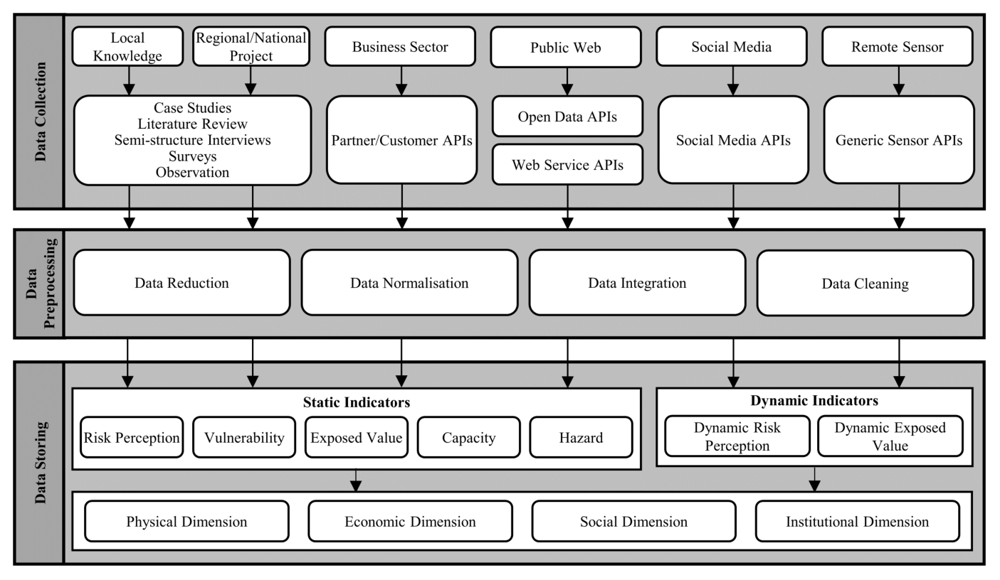
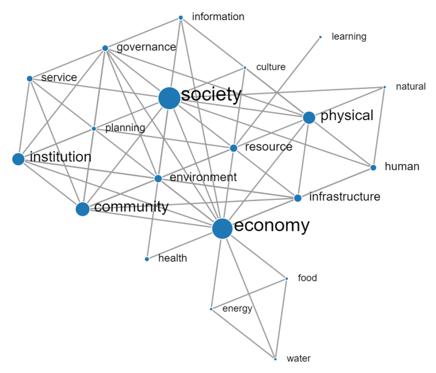

## TL;DR
The paper designs a **community resilience data repository** informed by a literature review (77 records) and a **35-respondent practitioner survey**. Respondents strongly want multi-source data (97%) and to learn from other communities (94%). Few know how to assess resilience (43%) or which data to use (34%). The proposed architecture collects static and dynamic indicators from six source types and supports search, ML-based simulation and recommendation.

## Problem
Community resilience is complex and hard to capture as explicit knowledge. Communities face similar problems but have no common way to collect and share resilience data. Earlier repositories were narrow (family, workplace, earthquakes only).
- **RQ1:** what are the main components of community resilience?
- **RQ2:** how should a repository be designed, and who would use it?

## Approach
- **Literature review:** a network of resilience dimensions from 77 records (2000–2020) (Fig. 1). Four dimensions were selected: **social, economic, physical and institutional**.
- **Survey** (Table 1): 25 questions in four groups: G0 respondent role, G1 assessing resilience, G2 data sources and availability, G3 repository applications. Snowball sampling gave 35 responses.
- **Architecture** (Fig. 16): six sources (local knowledge, regional/national projects, business sector, public web, social media, remote sensors) → data collection (qualitative methods and APIs) → preprocessing (reduction, normalization, integration, cleaning) → storage of **static indicators** (risk perception, vulnerability, exposed value, capacity, hazard) and **dynamic indicators** (risk perception from social-media sentiment, exposed value from sensors), organized by the four dimensions.
- **Use cases:** search engine, ML-based resilience simulation, and indicator recommendation by collaborative filtering.

*Fig. 16: Data collection → preprocessing → storage of static and dynamic indicators across physical, economic, social and institutional dimensions.*

*Fig. 1: Co-occurrence network of resilience dimensions in the literature (node size = frequency).*

## Key results (survey)
- **Respondents:** mostly academics and researchers, then emergency services and healthcare (Figs. 2–4).
- **Knowledge gap:** 43% know how to assess their community's resilience and 34% know which data to use (correlation 0.71).
- **85%** think modelling resilience along dimensions is valuable; **all four dimensions** are rated important (Figs. 5, 8).
- **Data:** 97% want multiple sources. **Local knowledge** is rated most useful and most available (>70%); remote-sensor and business data are least available because of privacy and policy (Figs. 10–11).
- **94%** are interested in learning from other communities. Only 2 of 35 had used a resilience repository.
- **Interfaces and users:** search engines are preferred, then simulations (>50%) and recommendation (45%). The main users would be local community managers, mostly in the **preparedness** phase. **Data privacy** is the top concern (Figs. 12–15).

## Contributions
1. A general architecture for a community resilience data repository, grounded in literature and practitioner needs.
2. Survey insights on data sources, indicators, interfaces, users and challenges.
3. Example applications (search, simulation, recommendation).

## Limitations & future work
- The survey sample lacks diversity (geography). No concrete solutions yet for privacy, authenticity or security.
- Future work: more dimensions and indicators, cloud deployment, semantic search, indicator recommendation and visualization.
