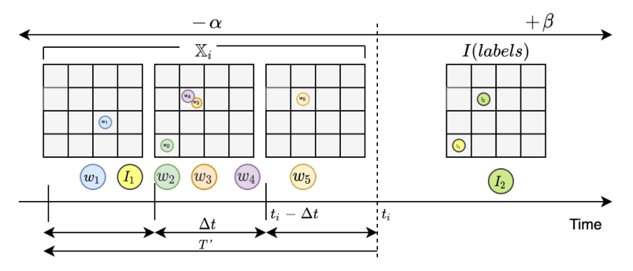
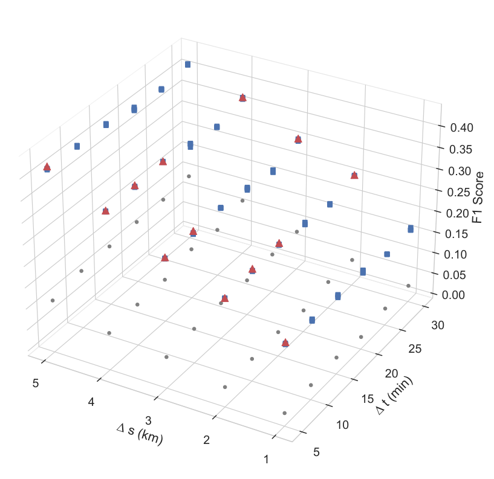

## TL;DR
**CROME** (Crowdsourced Multi-Objective Event Detection) uses a CNN to detect road accidents from gridded Waze reports plus traffic and weather. Pareto optimization then trades detection F1 against the **spatial and temporal resolution** that responders need. It reaches **F1 41.0 vs. 0.6** for the earlier Bayesian-fusion method, detecting about 40% of incidents early, about 14 minutes ahead and within about 3 km.

## Problem
Crowdsourced reports allow earlier detection than 911 calls but are noisy and displaced in space and time. **Maximizing accuracy alone is not enough:** a detector that is accurate only at a 5 km or 1-day resolution is useless for dispatch. Prior work lacked (1) principled fusion that generalizes across platforms, (2) systematic study of discretization hyperparameters and (3) a framework that encodes **practitioner preferences** on localization.

## Approach
- **Discretization** (Fig. 1): a grid of Δs-km cells and Δt-minute steps. Each step becomes a tensor (cells × features): report volume, sum and mean of Waze reliability, precipitation and mean traffic congestion. The tensors over a window T′ are stacked.
- **Labels:** positive if a ground-truth accident occurs within distance δ and time window [t − α, t + β]. β allows for official reports lagging behind the crowd.
- **Formulation:** multi-objective: maximize F1 while minimizing Δs and Δt (Eq. 1).
- **Solution:**
  1. A CNN (2 conv layers, 256 filters of 2×2, max pooling) exploits spatial proximity between where a report is filed and where the incident happened.
  2. An **ε-dominance evolutionary algorithm** finds the Pareto front over (F1, Δs, Δt). Practitioners pick a model from the non-dominated set.
- **Evaluation:** rolling three-month train / one-month test; α = β = 1 h, T′ = 30 min. Metrics are F1, early-prediction %, average distance and average early time.
- **Baseline:** Bayesian information fusion (BF) from [Emergency Incident Detection from Crowdsourced Waze Data Using Bayesian Information Fusion](/publications/2020-senarath-wi-iat-waze-bayesian-information-fusion/).

*Fig. 1: Reports in grid cells aggregated over Δt steps into X_i; labels I from ground-truth incidents within −α/+β.*

## Key results
- **The CNN beats BF on F1 at every resolution** (Fig. 2). F1 falls as cells get smaller, while Δt barely matters, probably because of aggregation over T′.
- **Pareto front** (Fig. 3): the non-dominated models are offered to practitioners.
- **Table I, best models per practitioner metric:**
  - Best early-prediction %: CROME **F1 41.0**, 40.3% of incidents caught early, 2.96 km, 13.9 min early, P 0.32 / R 0.56. BF reaches 77.6% early but with **F1 0.6 (precision ≈ 0)**.
  - Best distance: CROME 2.67 km at F1 16.4 vs. BF 3.16 km at F1 10.6.
  - Best early time: CROME F1 30.4, 14.9 min vs. BF F1 6.5, 15.5 min.
- **BF's alerts are about 85% false positives**, which is infeasible for dispatch. CROME balances precision and recall with competitive localization.

*Fig. 3: Each point is a model over (Δs, Δt, F1). Red triangles are Pareto-optimal CROME models, blue squares other CNN models, grey circles baselines.*

## Contributions
1. A novel multi-objective, practitioner-centric problem formulation for spatio-temporal incident detection from crowdsourced data.
2. A CNN that fuses crowdsourced reports with traffic and weather.
3. Pareto optimization that balances detection accuracy against localization.
4. Evaluation on real Nashville data showing better F1 and far fewer false alerts than the state of the art.
