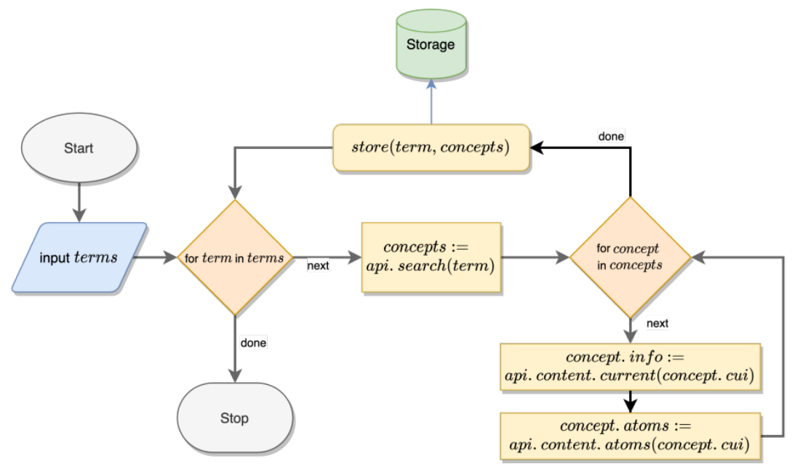
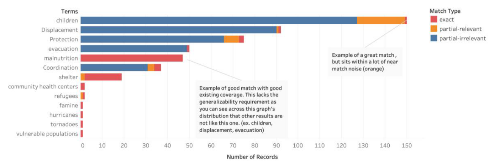

## TL;DR
An exploratory study of how well the **UMLS** biomedical knowledge base covers disaster-health terminology. Of 24 expert-chosen terms, **only 54% get even one exact concept match and 33% get none**. Only **16% of the 492 retrieved concepts are relevant**, the rest being noise such as "coordination" → *Cerebellar Ataxia*. The authors conclude UMLS needs extending before it can structure disaster social-media data.

## Problem
To extract public-health knowledge from social media during disasters, systems need a shared vocabulary aligned with the domain. UMLS is comprehensive for clinical text, but laypeople, responders and clinicians use different terms. Disaster-specific concepts (WASH, unaccompanied minors, complex emergencies) may be missing or ambiguous (Table 1).

## Approach
- **Terms:** 24 disaster-health terms sampled by a public-health and emergency-medicine expert from disaster manuals, guidebooks and coded Haiti 2010 situation reports.
- **Retrieval** (Fig. 1): the UMLS REST API search endpoint, restricted to six vocabularies (SNOMEDCT_US, MSH, HL7V3.0, WHO, LNC, MEDLINEPLUS), then the content endpoint for each concept's details and its first four atoms (Table 2).
- **Annotation:** a medical doctor working with humanitarian organizations labelled each CUI as **Exact**, **Partial** (relevant or irrelevant) or **Missing**.
- Analysis by term, match type and source vocabulary.

*Fig. 1: For each term, search the UMLS API, then fetch each concept's info and atoms and store them.*

## Key results
- **492 CUIs** retrieved for 24 terms.
- **13 terms (54%)** have at least one exact match (Table 4): children, community health centers, coordination, displacement, evacuation, famine, hurricanes, malnutrition, protection, refugees, shelter, tornadoes, vulnerable populations.
- **Only 79 of 492 CUIs (16%)** are exact matches. Most are partial and irrelevant (Fig. 3), e.g. coordination → Cerebellar Ataxia, displacement → Hip Dislocation, evacuation → Incision and drainage, protection → Foot protection (Table 5).
- **8 terms (33%) have no concept at all:** WASH, road access, medical logistics/distribution, Emergency Operations Center, damaged health infrastructure, complex emergency, burial practices, acute respiratory illness.
- **By vocabulary** (Fig. 4): LNC has the widest coverage, but vocabularies overlap little, so no single one is enough.

*Fig. 3: Exact, partial-relevant and partial-irrelevant returns per term (N = 492).*

## Contributions
- A quantitative assessment of UMLS coverage of disaster-health terminology.
- Evidence that UMLS ontologies and knowledge bases need extending, and that NLP beyond lexical matching is needed for disaster informatics.

## Limitations & future work
- Small term set (24), because one expert reviewed every result. Crowdsourced relevance judgments are planned.
- Retrieval limited to the REST API; NLP methods could improve recall.
- Terms come from literature; social-media terms (e.g., from COVID-19) are future work.
