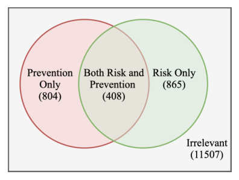
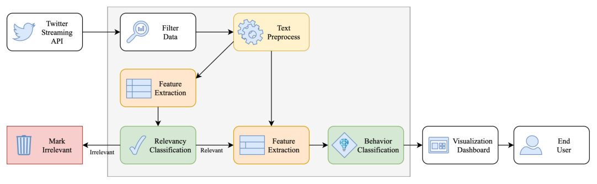

## TL;DR
With eight Community Emergency Response Teams (CERTs) in the Washington D.C. area, the authors defined a **risk-preventing vs. risk-taking behavior schema** for COVID-19 tweets. Volunteers labelled **13.6k tweets**, and a hierarchical classifier (relevance, then multi-label behavior) filters the stream with **relevance AUC 0.88** and **behavior micro-F1 0.81**.

## Problem
Most social-media crisis research covers natural hazards, not pandemics. City emergency services need to know whether the public is **following or undermining protective measures** (masks, distancing), because behavior drives mobility and their resource needs. No schema or dataset existed for this.

## Approach
- **Schema** (with a certified emergency manager and CERTs): *Risk-preventing* (supports measures such as masks and distancing), *Risk-taking* (undermines them), or *Irrelevant*. Prevention and Risk can co-occur (Table 1).
- **Data:** about 2.1M geo-fenced D.C.-metro tweets (Mar–May 2020), filtered with 1,521 CERT-curated keywords. 14k sampled; **39 CERT volunteers labelled 13,584**. Each tweet has at least 2 annotators, and an emergency manager adjudicated relevance disagreements.
- **Agreement:** Cohen's κ 0.64 for relevance and 0.53 for Prevention and for Risk; percent agreement 89–90% (Table 2). Hard even for trained humans.
- **Framework** (Fig. 2): stream → relevance classifier → multi-label behavior classifier → dashboard.
- **Features:** tf-idf (M1), mean 200-d GloVe (M2), both combined (M3). LR and linear SVM, one-vs-rest for multi-label, stratified 10-fold CV.

*Fig. 1: 804 Prevention-only, 865 Risk-only, 408 both, 11,507 irrelevant.*

*Fig. 2: Twitter stream → filtering and preprocessing → relevance classification → behavior classification → visualization dashboard.*

## Key results
- **Relevance (Table 3):** tf-idf works best. **LR M1 reaches F1 0.73, AUC 0.88**; embeddings alone give F1 0.55. Corpus-specific lexical cues separate irrelevant content well.
- **Behavior (Table 4):** combining features helps. **LR M3 reaches micro-F1 0.81, AUC 0.77**; Risk F1 0.82, Prevention F1 0.79.
- Logistic regression beats SVM on both tasks. Keeping stopwords helps behavior classification (AUC 0.76 vs. 0.74).
- Error analysis (Table 5): the hybrid model catches implicit prevention (e.g., "keeping a healthy distance at the Arboretum") that tf-idf misses.

## Contributions
1. A novel, practitioner-defined risk-behavior schema for pandemic social-media content.
2. A labelled dataset created with CERT volunteers.
3. A classification framework that rapidly filters social streams for risk behaviors for city emergency services.

## Limitations & future work
- Few relevant examples for training deep models; few modelling schemes tried.
- Future: more labels, deep learning, psycholinguistic features, unsupervised pattern discovery.
