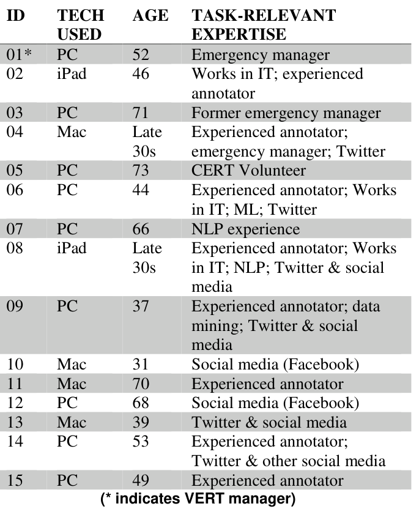

## TL;DR
A methods paper from the COVID-19 human-AI teaming project. Researchers ran **more than 50 Zoom interviews with screen sharing** while volunteer annotators labelled tweets in the lab's annotation platform. It documents five challenges specific to fully online research: researchers acting as **help desks**, **privacy** leaks, **missing context**, harder **think-aloud**, and **panoptic observation effects**. It also offers best practices and two training videos.

## Problem
COVID-19 moved qualitative research online, but method guidance barely covered **screen-shared observation** or **repeated interviews** with the same participant.
- **RQ1:** what challenges arise in synchronous, fully mediated research with multiple interviews?
- **RQ2:** how can the lessons be turned into training for other researchers?

## Approach
- **Setting:** 14 Virtual Emergency Response Team (VERT) volunteers and their manager. Volunteers labelled COVID-19 tweets in an **online annotation platform** while researchers observed via Zoom (Table 1). Volunteers were paid $25/h for three one-hour sessions.
- **Data collection:** five researchers from three universities, usually two per session; Calendly scheduling; semi-structured interviews with a think-aloud protocol; IRB approved.
- **Analysis:** weekly team meetings for 8 weeks, field notes and recordings, constant comparative analysis into core categories.

*Table 1: The 15 participants: device, age and task-relevant expertise.*

## Key results
- **Challenges confirmed from the literature:** technical issues, technology competence, rapport, distractions, and giving feedback.
- **Five new challenges**:
  1. **Researchers as real-time help desks.** Institutional Zoom settings differed, iPad vs. desktop screen-share buttons have different names, bandwidth drops (one participant was bumped seven times), and lost annotation-platform passwords or links.
  2. **Privacy.** Names appear in recordings; personal email and texts surface during screen sharing; household members are captured.
  3. **Missing context.** Weather and bandwidth at the participant's end are invisible, as are printed label guides on desks.
  4. **Think-aloud is harder.** Face-to-face video makes participants treat the researcher as a collaborator and seek affirmation.
  5. **Observation (panoptic) effects.** Self-view prompts self-consciousness, while screen sharing hides the observer.
- **Theory:** supports cues-filtered-out theory, but also Walther's **hyperpersonal model**: repeated sessions built strong relationships (follow-up emails, LinkedIn invites). It also highlights **technology affordances**: the "same" Zoom behaves differently across users.
- **Practical output:** two training videos for researchers doing mediated studies.

## Contributions
1. Method guidance for fully mediated, screen-shared, multi-session research.
2. Theoretical extensions (cues-filtered-out, hyperpersonal model, surveillance, affordances).
3. Training videos for the IS research community.
