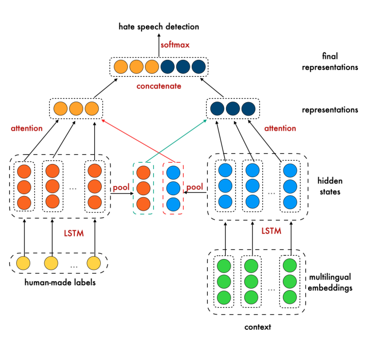
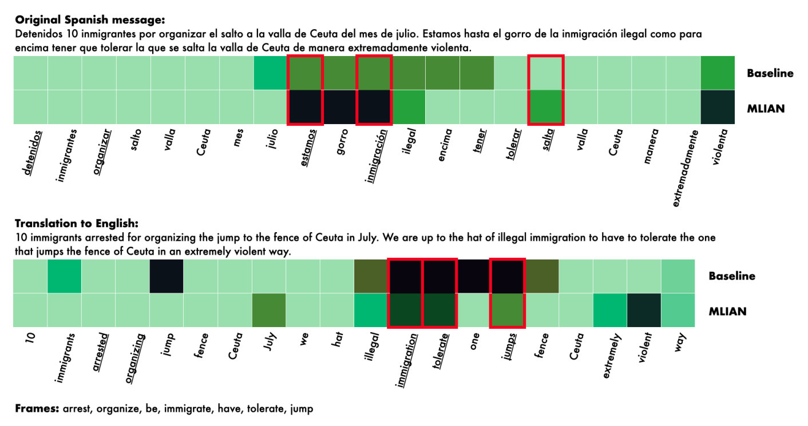

## TL;DR
**MLIAN** adapts interactive attention networks so that a simulated human's **hate-target label** (individual vs. group) steers attention while the model is trained on English and Spanish tweets. It reaches **AUC 84.1 / F1 84.9**, vs. 79.4 / 71.6 for the best LSTM baseline. Feedback on **under 4% of training data** (500 labels) gives significant gains. Attention maps line up with **semantic frames** in both languages.

## Problem
Most hate-speech detectors work in one language, depend on lexicons that age quickly, miss local slang and implicit hate (e.g., "building a wall"), and fail when the target group changes (immigrants vs. women). Deep models are also opaque, so humans can't give useful feedback.
- **RQ1:** does an interactive attention network with human-in-the-loop feedback improve multilingual detection?
- **RQ2:** does frame-guided feedback speed up convergence?
- **RQ3:** how much feedback is needed?

## Approach
- **Architecture** (Fig. 2): two LSTMs over multilingual embeddings, one for the **target** (from human feedback) and one for the **context**. Mutual attention links them, and the concatenated representations go to a softmax.
- **Embeddings:** LASER (1024-d sentence vectors, 93 languages) or DistilmBERT (token-level).
- **Feedback design, guided by frame semantics:** humans supply the hate-target element (individual or group) of the frame. Here this is simulated with the HatEval target-type labels.
- **Interpretability:** SLING frame parsing of Spanish tweets and their English translations, compared with MLIAN attention maps with and without feedback (Figs. 3–4).
- **Baselines:** SVC, RF, SGD and MLP on LASER; LSTM on LASER and on DistilmBERT. 10-fold CV; accuracy, AUC and weighted F1.

*Fig. 2: Target LSTM (human-labelled hate target) and context LSTM over multilingual embeddings, with interactive attention, concatenation and softmax.*

*Fig. 4: Attention for a Spanish tweet and its English translation, baseline vs. MLIAN with feedback. Red boxes mark words matching SLING frames.*

## Key results
- **Multilingual (Table 3):** **MLIAN+LASER reaches ACC 85.06, AUC 84.14, F1 84.94.** MLIAN+DistilmBERT scores 81.24 / 79.84 / 81.00. The best baselines are LSTM+LASER (AUC 79.38, F1 71.58) and SVC+LASER (F1 71.85).
- **Minimal feedback (Table 4):** baseline F1 73.15 → 100 labels 74.16 → **500 labels (about 4% of training data) 77.44 (p = 0.001)** → 1,000 labels 78.62.
- **Cross-lingual (Table 5):** EN→ES AUC 68.2 (LSTM 65.7); ES→EN AUC up to 79.0 (LSTM 68.6).
- **Cross-target (Table 6):** migrants→women AUC 80.3 (MLIAN+LASER); women→migrants AUC 82.7 (MLIAN+DistilmBERT); LSTM baselines reach at most about 74.
- **Interpretability:** with feedback, attention correlates more strongly with semantic frames, consistently across languages.

## Contributions
1. The MLIAN model for language-agnostic hate-speech detection.
2. A principled, frame-semantics-based way to guide human feedback and to analyze model reasoning.
3. Evidence that little feedback (under 4%) is enough.
4. Cross-lingual and cross-target gains.

## Limitations & future work
- Only two target groups and two languages.
- Human feedback is **simulated** with existing labels; testing with real humans is future work.
