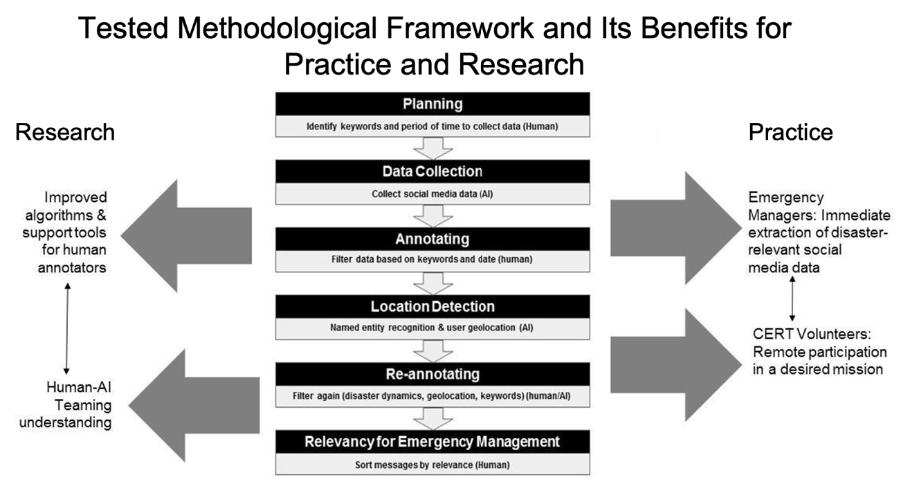
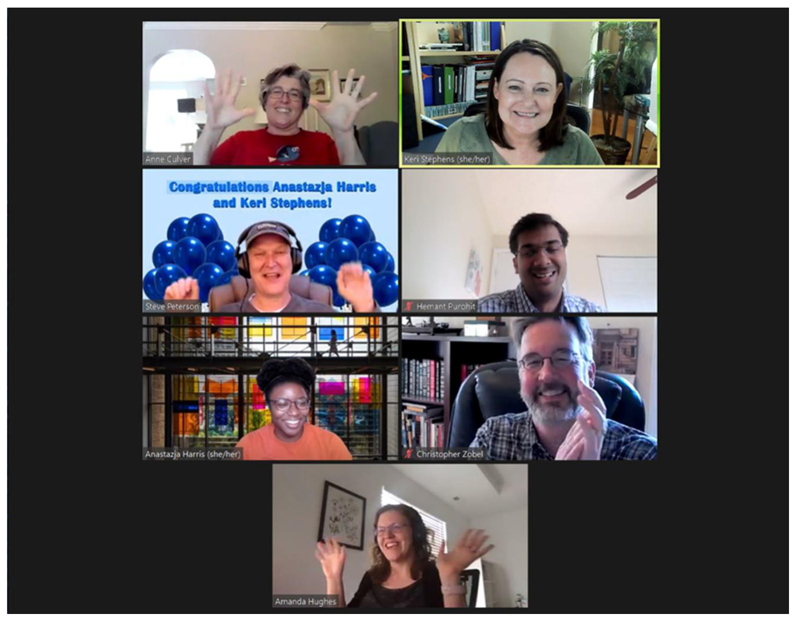

## TL;DR
A reflexive case study of the 6-month NSF RAPID project in which researchers from three universities, emergency-management practitioners and 120 volunteers built and used a **human-AI social-media monitoring system (CitizenHelper)** for the Washington D.C. region during COVID-19. It names **job-related and timescale challenges** of practice–research collaboration and offers **eight best practices**.

## Problem
Practitioners and researchers have different incentives (solve problems now vs. publish), processes (IRB review, academic calendars) and timescales. The "research–practice divide" often prevents disaster-research partnerships from forming or lasting.

## Approach
- **Case:** the human-AI teaming workflow (Fig. 1), first designed in 2018: practitioner-defined keywords → **CitizenHelper** real-time Twitter collection for the National Capital Region → volunteers label relevance, risk and prevention behavior, and sentiment → hierarchical classifiers (relevance F1 0.73 / AUC 0.88; behavior F1 0.81 / AUC 0.77, from [Mining Risk Behaviors from Social Media for Pandemic Crisis Preparedness and Response](/publications/2021-senarath-sbp-brims-mining-risk-behaviors-pandemic/)). In parallel, 61 Zoom think-aloud interviews with volunteers.
- **Method:** participant observation and reflexivity, informed by weekly team meetings, presentations and joint grant writing.

*Fig. 1: Planning → data collection (AI) → annotating (human) → location detection (AI) → re-annotating (human/AI) → relevancy sorting (human), with benefits to research and practice.*

## Key findings
- **Job-related challenges**:
  - *Process differences:* IRB delays (eased because the pandemic was slow-moving and the relationship pre-existed), academic calendars and student turnover, and unpredictable funding. These were handled with a fluid team of four core researchers.
  - *Equal partnership:* shared decisions, visible partnership with volunteers, rotating first authorship (including the practitioner).
- **Timescale challenges**:
  - *Helping now vs. future understanding:* fast fixes from interview feedback, e.g. a **profanity filter** that replaces swear words with "[swear word]" and improved labelling-interface navigation, built by the system engineers.
  - *Reporting progress:* thank-you videos; briefings at FEMA's COVID-19 Crowdsourcing Unit meetings (8 weeks) and to the White House OSTP and NIH (Dec 2020).
  - *Engagement:* weekly meetings, on-call technical staff, celebrations, challenge coins.
- **Eight best practices**: early relationship building, workflow continuity, shared recognition, continual communication, team-building, joint public communication, real-time feedback, and sharing insights.

*Fig. 2: The project team celebrating over Zoom.*
