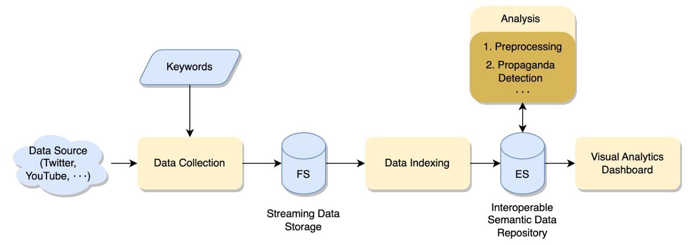
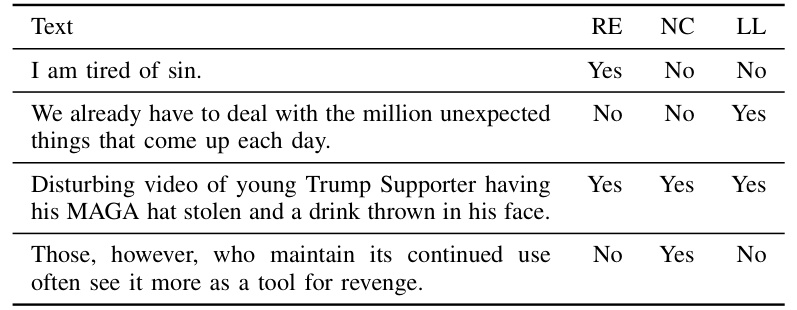

## TL;DR
An end-to-end, human-centered system that streams social media posts on a user-chosen topic, tags each post with propaganda techniques (loaded language, name calling, repetition) using a fine-tuned BERT model, and visualizes the result in a real-time dashboard for crisis-management analysts.

## Problem
Propaganda on social media (e.g., COVID-19 misinformation, Brexit, 2016 US election) can cause cascading harm during humanitarian crises. Most research detects or characterizes propaganda techniques in isolation; few works build an **end-to-end system** for identifying, analyzing, and visualizing propaganda behavior in **short, context-poor social media streams**. The closest prior tool, Prta, targets news articles.

## Approach
- **Builds on CitizenHelper**, the group's streaming analytics system ([Citizen-Helper System for Human-Centered AI Use in Disaster Management](/publications/2023-senarath-handbookdisasterresearch-citizen-helper-system/)), extending it for propaganda.
- **Design requirements:** simplicity (non-technical users), interactivity (human agency over AI-driven analytics), extensibility.
- **Pipeline:** keyword-driven Twitter filtered-stream collection → batched JSON storage → Elasticsearch indexing → analysis (preprocessing + detection) → Kibana dashboard (Fig. 1).
- **Model:** BERT encoder + 3-output sigmoid head, multi-label, binary cross-entropy, 5 epochs.
- **Data:** SemEval-2020 Task 11 news articles split into sentences to mimic tweet threads; three most frequent techniques kept; 84/16 train/test split; 1837 / 924 / 563 training samples per label.

*Fig. 1: Keywords drive data collection → streaming storage → Elasticsearch → analysis → dashboard.*

*Table I: Example sentences for the three techniques. RE = Repetition, NC = Name Calling/Labeling, LL = Loaded Language.*

## Key results
- Fine-tuned BERT: **micro-F1 = 38%, AUC = 61%** on the held-out test set. These are **preliminary** results.
- The model **struggles with repetition**, likely because sentence-level prediction lacks context.
- Working dashboard demonstrated on live **climate-change** tweets, with three views: propaganda timeline, keyword tree-map per technique, and per-tweet probability table, plus filters by topic, time and technique probability (Fig. 2).

## Contributions
1. A model that detects propaganda techniques in short text.
2. Visualizations for studying propaganda dynamics via salient keywords and statistical summaries of technique prevalence.
3. A real-time, extensible system architecture aimed at decision-makers in crisis-management agencies.

## Limitations & future work
- No use of context (e.g., historical related posts); no multimodal or multilingual support.
- Future work: add message history plus external knowledge (domain and linguistic KBs), multimodal/multilingual models, other platforms.
