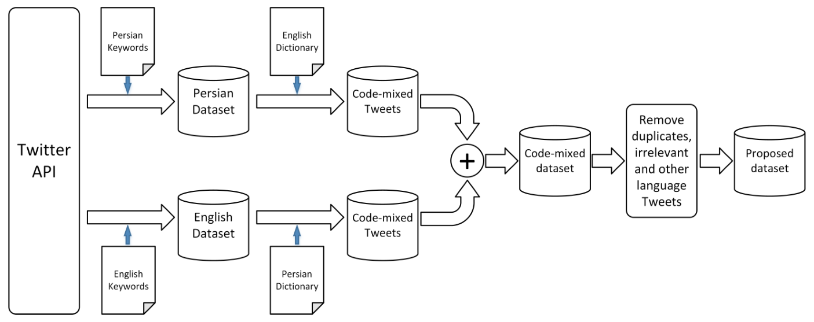
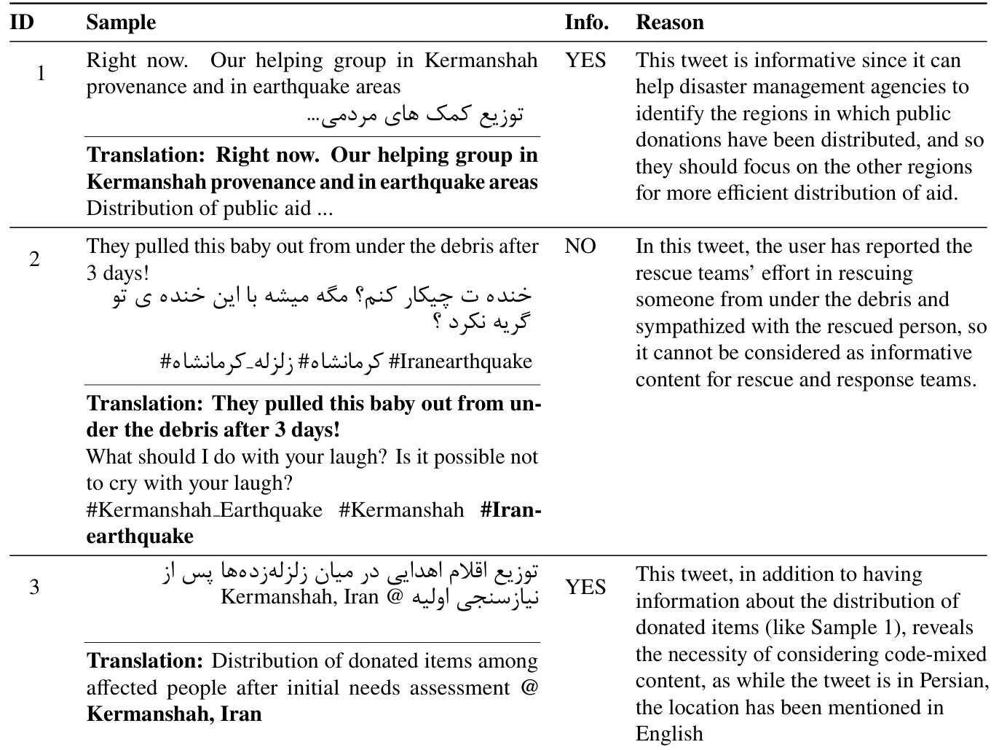

## TL;DR
The **first Persian–English code-mixed crisis dataset**: 1,758 tweets about the 2017 Iran–Iraq earthquake, labelled for informativeness. A benchmark of three pre-trained language models finds **multilingual mBERT best (F1 72%)**, ahead of XLM-R (63%) and English-only RoBERTa (62%). The paper also lists six code-mixing patterns that users follow.

## Problem
Crisis NLP filters informative posts, but **code-mixing** (mixing languages in one post) is barely studied there. Language models aren't trained on code-mixed text, and its patterns depend on sociolinguistic factors.

## Approach
- **Collection:** Twitter API through **TweetKit** (your Python academic Twitter client), Nov 12 – Dec 12, 2017, with Persian and English keyword lists. This gave 367k Persian and 190k English tweets, extended with replies to 593k and 329k (Table 3).
- **Code-mix filtering** (Fig. 1): English event dictionary applied to Persian tweets and vice versa → 3,962 code-mixed tweets → retweets, irrelevant and other-language tweets removed; hashtags split and kept; deduplication → **1,758 tweets**.
- **Annotation:** Informative if it reports cautions, casualties, needs, rescue or volunteering, donations, damage or blocked roads (following Alam et al. and Purohit & Peterson). One annotator; **709 informative**.
- **Models:** mBERT, XLM-R and RoBERTa with a linear head on [CLS]; AdamW, 3 epochs, learning rate 5e-5; 10-fold CV.

*Fig. 1: Persian and English keyword collection → dictionary-based code-mix extraction → merge → cleaning → final dataset.*

*Table 1: Informative and non-informative code-mixed samples, with reasons.*

## Key results
- **Table 4 (mean ± std, %):**
  - **mBERT:** accuracy 81 ± 8, recall 72 ± 26, precision 71 ± 25, **F1 72 ± 25**.
  - XLM-R: 77 / 60 / 72 / 63.
  - RoBERTa: 76 / 50 / **84** / 62 (highest precision, lowest recall).
- Multilingual models beat the monolingual one, and XLM-R beats RoBERTa, its English counterpart.
- **Error analysis** (Table 5): RoBERTa misses Persian content with English insertions; short or partly informative tweets fool all models; mBERT relies on key tokens such as hashtags, which brings false positives; Persian half-space spelling breaks tokenization.
- **Six code-mixing patterns**: hashtags in the other language; hashtag-only posts; full translation; one-language summary; insertional switching (e.g., entity names); inter-sentential switching.

## Contributions
1. The first curated Persian–English code-mixed crisis dataset.
2. Informativeness labels to help response agencies.
3. A benchmark of three pre-trained language models with insights for modelling code-mixed data.

## Future work
- Sociolinguistic factors (demographics, proficiency, intent); linguistic code-mixing metrics (CMI, MI); larger and augmented data.
