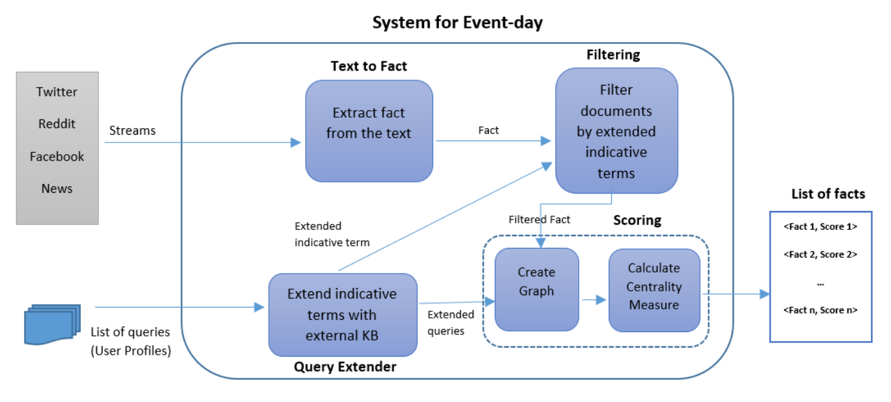
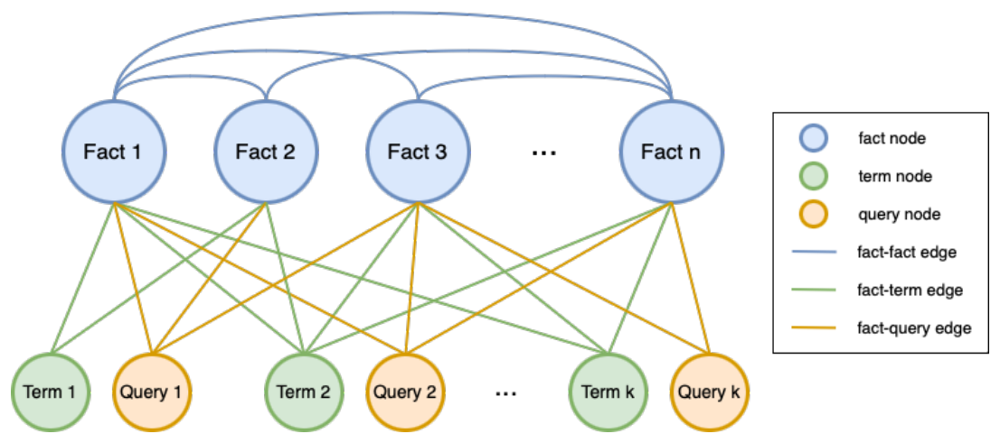

## TL;DR
A TREC CrisisFACTS system that turns multi-platform crisis streams into ranked fact lists. It **extracts facts** (REBEL or ClausIE), **filters** them with KeyBERT-extended indicative terms from responders' queries, and **ranks** them by closeness centrality in a graph linking facts, terms and queries. The ClausIE variant (B) scores best: **BERTScore F1 0.613** against NIST summaries, comprehensiveness 0.136 and redundancy score 0.507.

## Problem
Disaster responders need concise, timely facts from noisy, multi-source streams (Twitter, Reddit, Facebook, news). Matching a query isn't enough; a fact must matter for disaster-management information needs, which CrisisFACTS expresses as FEMA ICS-209-style queries.

## Approach
System design (Fig. 1), run per event-day:
1. **Text to Fact:** Method A uses **REBEL** (BART seq2seq relation extraction, 200+ relation types); Method B uses **ClausIE** (dependency-based open information extraction).
2. **Query Extender:** **KeyBERT** expands each query's indicative terms (Table 1).
3. **Filtering:** PyTerrier index (DFReeKLIM weighting); top-K facts retrieved per extended term, each with a relevance score.
4. **Scoring** (Fig. 2): a graph with fact, term and query nodes. Fact–fact and fact–query edges carry Sentence-BERT cosine similarity (pruned below 0.5); fact–term edges carry min–max-normalized retrieval scores. **Closeness centrality** with distance = 1 − weight gives each fact's importance (Eqs. 1–3).

*Fig. 1: Streams → text-to-fact → filtering by extended indicative terms → graph creation → centrality → ranked fact list.*

*Fig. 2: Fact, term and query nodes with fact–fact, fact–term and fact–query edges.*

## Key results
- **BERTScore (Table 2), F1 vs. NIST / Wikipedia summaries:** Method A 0.597 / 0.445; **Method B 0.613 / 0.480**.
- **ROUGE (Table 3), F1 vs. NIST / Wikipedia:** A 0.211 / 0.039; **B 0.319 / 0.028**. ROUGE against Wikipedia is very low for both.
- **Manual fact matching (Table 4):** redundancy score (precision-based, higher is better) A 0.305 / **B 0.507**; comprehensiveness (recall-based) A 0.058 / **B 0.136**.
- Method B is better across metrics, possibly because the scoring module handles ClausIE facts better.

## Contributions
- A modular system with an **integrated content-graph analysis** for ranking crisis facts, usable with any extractive or abstractive fact generator.
- Evaluation of two fact-extraction methods on TREC CrisisFACTS 2023.
