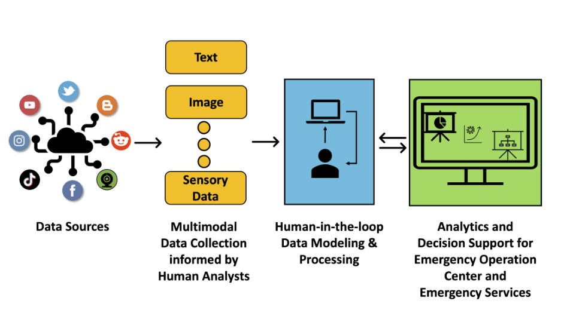
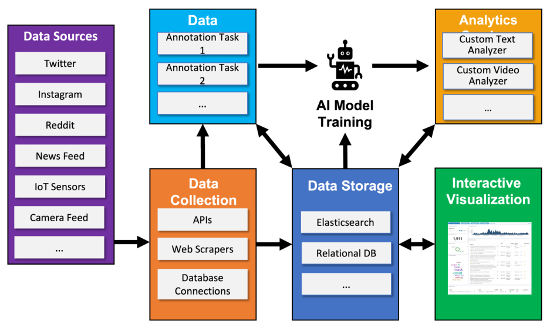

## TL;DR
A handbook chapter that sets out **human-centered AI design** for disaster information systems. It uses the lab's **Citizen-Helper** platform as the running example, built on modularity, extensibility, interactivity and simplicity, and adaptability through active learning. It shows two deployments: **COVID-19 risk-behavior analytics** with CERT volunteers (presented at IAEM 2021) and **multimodal video/IoT analytics** for first-responder training debriefs.

## Problem
Disaster agencies across mitigation, preparedness, response and recovery (Fig. 1.1) need timely information. Manual analysis does not scale, and fully automated AI is unreliable with noisy, drifting, multimodal data. Practitioners need to be involved **in design, not just evaluation**, and systems need human feedback loops to handle drift.

## Approach / content
- **Design principles**:
  1. **Modularity:** independent components with standard interfaces.
  2. **Extensibility and customizability:** new data sources, models and partner services.
  3. **Interactivity and simplicity:** for non-technical users, measured by the number of interactions and time per task.
  4. **Adaptability:** active learning and annotator-agreement analysis to handle concept drift.
- **Architecture** (Fig. 1.3):
  - *Data collection* (APIs, scrapers, database connections).
  - *Storage* (file system, relational database, Elasticsearch).
  - *Annotation* (schema design with practitioners, annotator training, agreement tracking, expert relabelling).
  - *AI model training* (supervised, semi-supervised or unsupervised, plus active learning).
  - *Analytics services* (custom text and video analyzers).
  - *Interactive visualization* (temporal trends, geographic activity, content analysis, data tables, demographics).
- **Use case 1, response and mitigation: COVID-19 risk behaviors**:
  - schema defined with a Certified Emergency Manager;
  - Twitter data, Mar–Sep 2020;
  - annotation by eight CERTs, with active learning that shows predicted labels;
  - Kibana dashboard (Fig. 1.4) with relevance filtering and expert feedback.
  - Presented to regional and national committees and at **IAEM 2021**.
- **Use case 2, preparedness: training exercises**: active-shooter and fire-response drills. IP-camera, wearable and IoT streams → object recognition for events (wounded patient, responder and so on) → Elasticsearch → a Kibana dashboard for instructors' debriefs (Fig. 1.5).

*Fig. 1.2: Data sources → multimodal collection informed by human analysts → human-in-the-loop modelling → analytics and decision support for emergency operations.*

*Fig. 1.3: Data sources, collection, annotation tasks, AI model training, storage, analytics and interactive visualization.*

## Key results
- Descriptive chapter with **no quantitative evaluation**; comparing performance with other systems is explicitly out of scope.
- Deployment outcomes: COVID-19 analytics presented at IAEM 2021 and to regional and national committees; training-exercise deployments for active-shooter and fire-response drills.

## Challenges & future directions
1. Slow ground-up deployment when no training data exists for a new disaster, which calls for pre-established practitioner partnerships and interpretable domain adaptation.
2. Errors in human input (mistakes and slips) degrade models.
3. Practitioner workload during data bursts, which calls for ranking events by serviceability.
