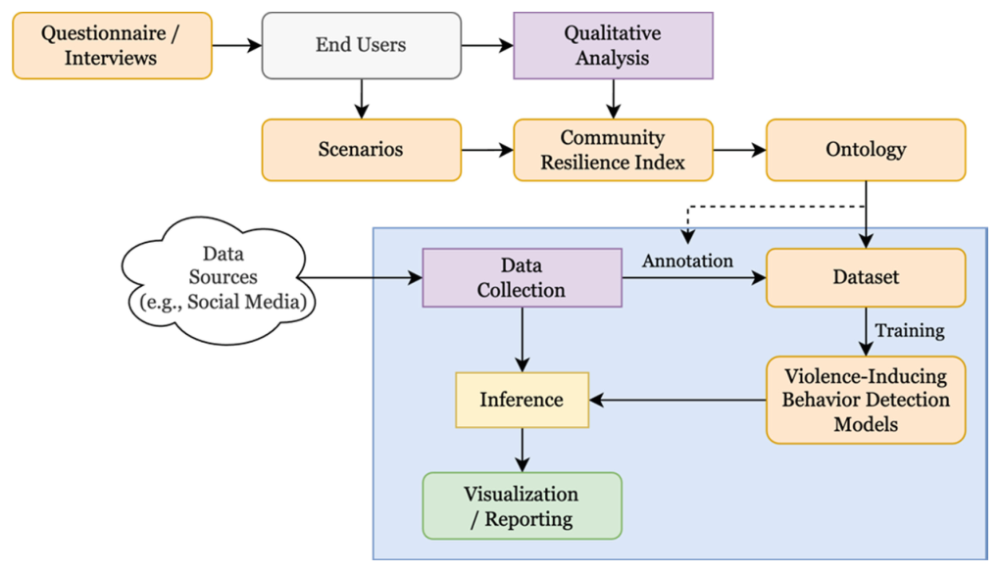
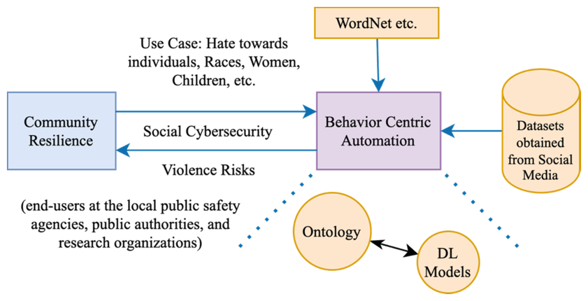

## TL;DR
A project paper describing **SOCYTI**, a Research Council of Norway project (Western Norway Research Institute and GMU). It aims to give local community services real-time, multilingual (including **Norwegian**) and multimodal detection of violence-inducing online behaviors such as hate speech, using **knowledge-base-driven augmentation** to make detectors robust across targeted identity groups.

## Problem
Hate speech, radicalization and polarization harm **community resilience**, a community's ability to cope with disasters together. Existing resilience indices (FEMA, UNISDR, EU Resiloc) ignore dynamic social-atmosphere risks. The paper lists four challenges:
1. Human-behavior indicators are missing from resilience models.
2. Social cybersecurity has few studies, and the definitions of malicious behavior are fragmented.
3. Labelled data is sparse (≈7% malicious) and English-centric; there is **no Norwegian dataset**, and models do not generalize across target identities.
4. Malicious content is increasingly multimodal.

## Approach (planned and ongoing)
- **Three objectives**:
  1. Characterize violence-inducing behaviors that harm resilience, and extend resilience indices.
  2. Infer them from multimodal, multilingual posts while respecting privacy.
  3. Build a real-time detection system for proactive intervention.
- **Stakeholder-driven** (Fig. 1): social scientists ran questionnaires and interviews to define scenarios, a community resilience index and an **ontology** of violence-inducing behavior.
- **Data:** Norwegian tweets collected with Hurtlex hate keywords, labelled hateful or not by manual review plus **LLM predictions**.
- **System** (Fig. 2): hate-speech detection as the foundation.
  - **Identity-term augmentation with WordNet synonyms** to cover under-represented target groups.
  - A custom knowledge base that extends WordNet using LLM-assisted mining.
  - Open Multilingual WordNet and DBpedia for cross-lingual context.
  - Continual training to follow evolving discourse.
  - Multimodal fusion by concatenating text and image encodings.

*Fig. 1: Stakeholder questionnaires → scenarios, resilience index, ontology → annotated datasets → detection models → inference → visualization and reporting.*

*Fig. 2: Behavior-centric automation linking community resilience, social cybersecurity, external knowledge (WordNet), ontology and deep-learning models.*

## Key results
- None yet. This is an ongoing-project overview with no experiments.

## Contributions
- An overview of SOCYTI's scope, objectives, background challenges and planned approach.
- A proposed hate-speech detection system as the basis for detecting violence-inducing behavior.
