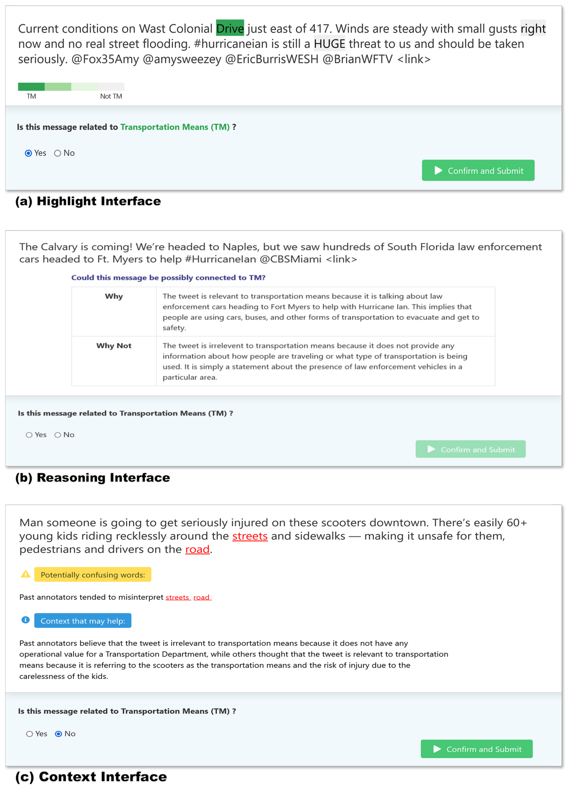
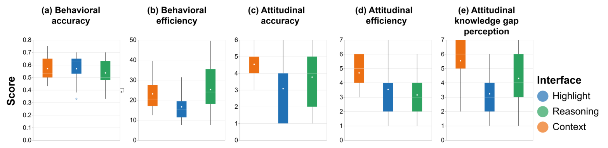

## TL;DR
Beginner annotators labeling disaster tweets disagree with experts mainly because of **confusing words** and **hidden context**. The authors built a **Context** interface that flags historically confusing tokens and uses an LLM to explain past expert–beginner disagreements. In a study with 13 CERT volunteers, it matched the best behavioral accuracy and was rated significantly better on perceived accuracy, efficiency and knowledge-gap reduction.

## Problem
Annotation UIs usually target *microtasks* that anyone can do (e.g., sentiment) and rely on ground-truth labels to guide annotators. Domain-specific tasks such as disaster information filtering need **institutional knowledge** that beginners lack. Few works study how annotation UI design can close the **knowledge gap** between beginners and experts on *objective* tasks.

## Approach
**S1: Formative study (8 participants: 4 experts, 4 CERT beginners; p.3–5)**
- Expert interviews about workflow, training challenges and the knowledge gap.
- Hurricane Ian tweets filtered with 475 expert-verified keywords (seeded with ChatGPT) gave 4,000 tweets. Each beginner labeled 1,000 as Transportation Means (TM), Damaged Infrastructure (DI) or Irrelevant (IR).
- Expert disagreement analysis over 909 disagreements: expert correct ≈51% (459), beginner correct ≈43% (392), neither ≈6% (58).
- Retrospective interviews found two main causes: **lack of contextual knowledge** (6 participants) and **missing visual or supplementary cues** (5 participants).

**Three interfaces (Fig. 1; p.6–8)**
- **Highlight** (baseline): colors the 2 most relevant and 2 least relevant tokens using **nPMI** computed on agreement data, plus expert keyword lists.
- **Reasoning** (baseline): an LLM generates *Why* / *Why Not* explanations from the tweet plus the expert label definition, then selects concise sentences in a second prompt.
- **Context** (proposed): (1) flags **ambiguous tokens** with an ambiguity measure AM ∈ [0.5, 1], where AM ≤ 0.7 counts as ambiguous, min frequency is 3 and the top 3 are shown; (2) an LLM explains the **reason for past annotators' disagreement** from their feedback (prompts in Figs. 3–4).

*Fig. 1: (a) Highlight, (b) Reasoning (LLM Why / Why Not), (c) Context (confusing-word hints plus hidden-context explanation).*

**S2: Summative study**
- 13 new CERT beginners (about 3.5 years of experience on average); within-subject design with Latin-square counterbalancing.
- 459 disagreement tweets, stratified into 3 sets of 40 (balanced TM/DI and FP/FN), so each participant labeled 120 tweets.
- Measures: behavioral accuracy and efficiency; attitudinal accuracy, efficiency and knowledge-gap perception (1–7 Likert scale).

## Key results (scenario S1, all data; Fig. 2)
| Metric | Highlight | Reasoning | Context |
|---|---|---|---|
| Behavioral accuracy (mean) | 0.57 | 0.54 | 0.57 (not significant) |
| Completion time, 40 tweets (min) | **16.59** | 25.23 | 23.05 |
| Perceived accuracy (1–7) | 3.08 | 3.77 | **4.54** (significant) |
| Perceived efficiency (1–7) | 3.54 | 3.15 | **4.69** (p < 0.04) |
| Knowledge-gap perception (1–7) | 3.23 | 4.31 | **5.54** (p < 0.03) |

- No significant behavioral accuracy differences in any scenario. After filtering accidental clicks, Context had the highest mean (0.58) and the best minimum and maximum accuracy.
- Highlight was significantly **faster** than both Reasoning (p < 0.05) and Context (p < 0.03).
- In the per-question chi-square analysis, Context beat both other designs on 13 of 40 questions, 7 of them significantly (p < 0.04).
- **Insight:** users *perceive* Context as most accurate and efficient even though Highlight is faster, so behavioral and attitudinal metrics diverge.

*Fig. 2: Box plots for (a) behavioral accuracy, (b) completion time, (c) perceived accuracy, (d) perceived efficiency, (e) knowledge-gap perception.*

## Contributions
1. Empirical understanding of the beginner–expert knowledge gap in disaster-data annotation, with *confusing words* and *hidden context* as its main causes.
2. A novel Context interface design built on those two causes.
3. A controlled experimental study (S2) of its effect.
4. Design implications: multi-step workflows, extension to images and video, feedback loops, multimodal ambiguity detection.

## Limitations
- The same dataset was used both for testing and for generating the context aids.
- Only one event (Hurricane Ian); ground truth from a single expert; the expert/beginner split may hide variability.
- Small sample (13 participants). LLM explanations can be verbose and may not follow label definitions.
