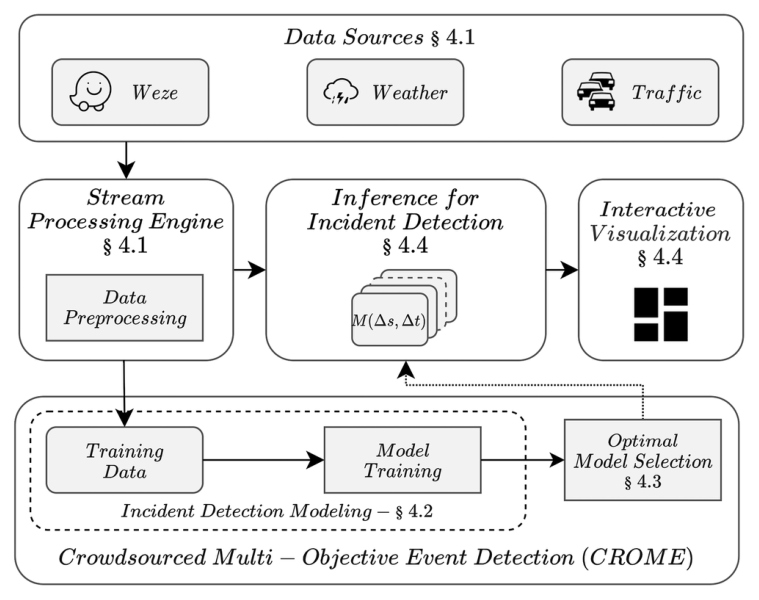
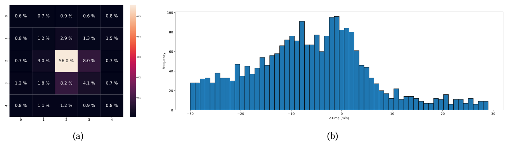

## TL;DR
The journal extension of CROME. It adds **CROMEx**, an interactive dashboard where emergency-response practitioners explore crowdsourced data, compare Pareto-optimal detection models across space/time resolutions and simulate real-time detection, then **choose the model themselves**. The CNN beats both Bayesian fusion and KNN: **F1 41.0 vs. 19.7 (KNN) and 0.6 (BF)**, detecting 40% of crashes early.

## Problem
Can crowdsourced data (Waze, social media) reveal incidents before 911 calls? The data are noisy:
- **Spatial uncertainty:** only about 56% of Waze reports fall in the same 1 km cell as the incident (Fig. 2a).
- **Temporal uncertainty:** reports come both before and after the official report (Fig. 2b).

Optimizing accuracy alone hurts localization, and practitioners need control over the trade-off. Existing tools (CitizenHelper, AIDR, Dataminr) don't help them evaluate and select models.

## Approach
- **Formulation:** models M(Δs, Δt) over grid resolutions; pick hyperparameters that maximize F1 while keeping resolution fine.
- **CROMEx architecture** (Fig. 4):
  1. Stream processing of Waze, traffic and weather into per-cell features: report volume, sum and mean of reliability, precipitation and congestion.
  2. Incident-detection modelling for many (Δs, Δt).
  3. **Optimal model selection** with ε-dominance evolutionary Pareto optimization (Algorithm 1).
  4. Interactive visualization.
- **Models compared**: CNN (2 conv layers, 256 filters of 2×2); **Bayesian information fusion** (BF, the earlier state of the art); **KNN** adapted from incident forecasting.
- **Evaluation:** rolling three-month train / one-month test, no temporal overlap. Metrics: F1, early-prediction ratio, average distance, average early time. CNN inference takes microseconds.

*Fig. 4: Data sources → stream processing → incident detection → interactive visualization, with an offline loop for model training and optimal model selection.*

*Fig. 2: (a) Share of Waze reports in each cell around the incident cell (56% in the same cell); (b) time offsets between Waze and official reports.*

## Key results
- **The CNN beats BF and KNN on F1 at every resolution** (Figs. 6–7). BF has high recall but terrible precision, while CNN balances the two (Fig. 8).
- **Pareto front** (Fig. 9): several non-dominated models are offered to practitioners.
- **Table 2, best model per practitioner metric:**
  - Best early-prediction %: CROME **F1 41.0**, 40.3% early, 2.96 km, 13.9 min; KNN F1 19.7, 17.7% early; BF F1 0.6 with precision ≈ 0.
  - Best distance: KNN reaches 2.05 km but misses **86.5%** of incidents (recall 0.03); CROME 2.67 km at F1 16.4.
  - Best early time: KNN 16.0 min at F1 11.3; CROME 14.9 min at **F1 30.4**.
- CROME is within **0.62 km** of the best spatial localization and **1.79 min** of the best temporal one, and no alternative beats it on both. BF's alerts are about **85% false positives**.
- **Dashboard** (Figs. 10–12): data explorer (incidents vs. Waze reports), model explorer (performance vs. resolution, optimal models highlighted), and real-time detection simulation.

## Contributions
1. A human-centered AI tool design (CROMEx) that extends CROME with interactive model selection for practitioners.
2. A demonstration of the spatial and temporal uncertainty in crowdsourced incident reports.
3. A comparison of CNN, BF and KNN on technical and practitioner-centric metrics.
4. An open-source tool plus a sample dataset (the official data is proprietary).

## Deployment directions & future work
- Needs real-time infrastructure, evaluation in agency simulation training, and practitioner training.
- Future work: other multi-objective algorithms and detection models.
