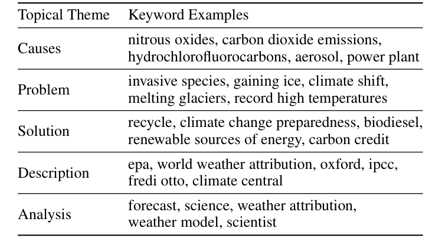
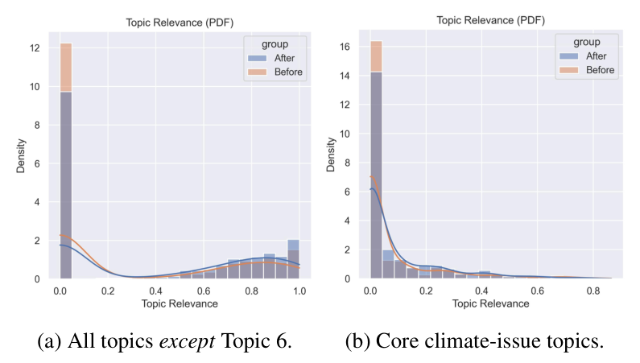

## TL;DR
**Evo-Lyzer** evaluates communication-training programs automatically by mining participants' social media before and after training. It uses an expert-guided author-topic model plus two new measures, **divergence** (group-level change) and **consistency** (individual-level steadiness). For **Climate Matters** (738 journalists and weathercasters, about 497k tweets), climate-relevant posting rose **31% overall and 22% for core climate topics**, with significant gains in consistency.

## Problem
Programs that train journalists and weathercasters to report on climate change need to know whether participants actually *post* more about climate afterwards: the attitude–behavior gap. Traditional evaluation (surveys, interviews, manual coding) is costly, small-scale, self-reported and usually measured at one point in time, so it misses longitudinal shifts.

## Approach
- **Measures**:
  - **Divergence** δr: percent change in a group's mean relevancy (probability of posting relevant content) before vs. after an event (Eqs. 1–2).
  - **Consistency** c = μ/σ of an individual's monthly relevancy, compared before vs. after (Eqs. 3–5).
  - Significance threshold p < 0.05.
- **System**:
  - *Data collection:* Twitter API timelines, 11 months before and after each participant's first event, to cover all seasons.
  - *Preprocessing:* Gensim phrase detection.
  - *Author-Topic Model* (6 topics), guided by **expert seed keywords** in 5 themes (causes, problem, solution, description, analysis; Table 1), with random under-sampling of posts without keywords and keyword priors. Topics refined iteratively with a climate-communication researcher.
  - *Dashboard* (Fig. 4): tweet tables, timeline and word cloud, topic explorer (modified pyLDAvis), and divergence and consistency plots.

*Table 1: Seed keywords from Climate Matters experts, used as topic-model priors.*

## Key results
- **Topics** (Table 2): topics 1–2 cover core climate issues (emissions, fossil fuels); topics 3–5 cover weather and climatic events; topic 6 is irrelevant.
- **Relevance detection:** 200 annotated tweets give **AUC 0.83** for topics 1–2 vs. the rest (single annotator) (Fig. 1b).
- **Divergence** (Fig. 2):
  - Topics 1–5: relevancy **0.31 → 0.41 (+31.2%, p = 1.5e-11)**.
  - Core topics 1–2: **0.074 → 0.090 (+21.7%, p = 8.0e-4)**.
- **Consistency** (Fig. 3):
  - Topics 1–5: 2.58 → 2.63 (+2.1%, p = 8.9e-7).
  - Core topics: **0.41 → 0.55 (+36.2%, p = 6.6e-7)**.
- Conclusion: participants' climate communication increased and became more consistent after Climate Matters events.

*Fig. 2: Distribution of relevancy before (orange) and after (blue) events: (a) all relevant topics, (b) core climate topics.*

## Contributions
1. An innovative social-media-mining system for measuring evolving communication behavior to support evaluation of intervention programs.
2. Divergence and consistency measures operationalized at group and individual levels.
3. The Evo-Lyzer system (web dashboard), reusable across domains.
4. Validation in a real climate-communication program case study.

## Limitations & future work
- Needs human input: keyword lists, topic review and topic labelling.
- **No control group**, so the changes are within-participant over time.
- The X/Twitter API is no longer free; Mastodon or online articles are suggested alternatives.
- Future work: BERT-based representations and more measures.
