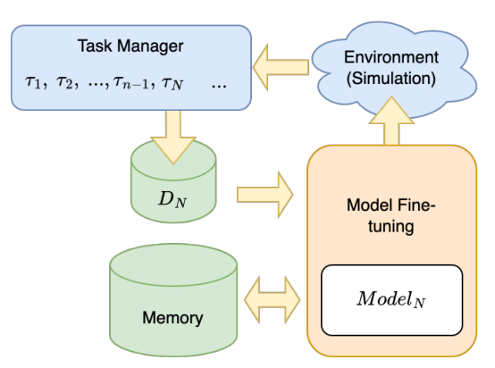
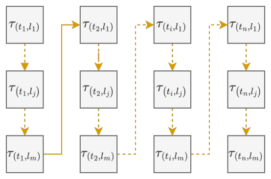

## TL;DR
The paper frames hate-speech detection as a **lifelong learning problem over a stream of (topic, language) tasks**. A multilingual transformer with an **LB-SOINN replay memory** keeps performance across past tasks better than batch or online fine-tuning: best average F1 on 7 of 10 tasks, e.g. task 2 at **0.63 vs. 0.51 / 0.54**.

## Problem
Hate speech changes with world events: new targets and topics appear, and it is posted in many languages. Static models trained on fixed topics or one language degrade. Naively updating them causes **catastrophic forgetting**. No prior work combined lifelong learning with multilingual hate-speech detection.

## Approach
- **Problem:** a task τ(t, l) is binary hate detection for topic t in language l. Tasks arrive in sequence, and after each one the model is evaluated on the current and all past tasks (Figs. 1–2).
- **Task-stream simulation:** BERTopic (multilingual sentence encoder, UMAP, HDBSCAN; 8 topics, at least 50 documents each) assigns topics. (Topic, language) groups are ordered by size, giving **10 tasks**.
- **Data:** the MLMA multilingual hate-speech tweets, English and French, binarized (any non-normal label counts as hateful). French tweets are machine-translated to English to balance topics.
- **Model** (Fig. 3):
  - *Learning component:* a pre-trained multilingual language-model encoder plus a linear head, fine-tuned with AdamW on cross-entropy plus a **memory replay loss**.
  - *Memory component:* **LB-SOINN** (load-balancing self-organizing incremental neural network) keeps the most important instances from past tasks.
- **Baselines:** batch learning (an independent model per task) and online learning (sequential fine-tuning without forgetting prevention). Learning rate 1e-5, batch size 8, 10 epochs with early stopping.

*Fig. 3: Task manager → dataset D_N → fine-tuning with memory replay → model N.*

*Fig. 2: Tasks ordered by topic, with all languages for a topic arriving together.*

## Key results
- **Across tasks (Table 2, Fig. 4):** lifelong learning has the best average F1 on **7 of 10 tasks** (task 6 is a tie), e.g. tasks 1–4: 0.53 / 0.63 / 0.60 / 0.52 vs. batch 0.47 / 0.51 / 0.49 / 0.44. The baselines degrade toward the end of the stream.
- **Outlier:** task 7 collapses to F1 0.06 but recovers after task 8 (same topic, other language), a sign of possible cross-lingual transfer.
- **On the newest task only (Fig. 5):** batch 0.51 > lifelong 0.48 > online 0.42. A dedicated per-task model wins on the new task, but lifelong learning keeps past tasks without retraining.

## Contributions
1. A new problem formulation: multilingual lifelong hate-speech detection over a topic and language task stream.
2. A method combining a multilingual pre-trained encoder with an LB-SOINN memory against forgetting.
3. Evaluation on a bilingual (English/French) dataset against batch and online baselines.

## Future work
- More languages and topics; semi-supervised learning for largely unlabelled streams.
