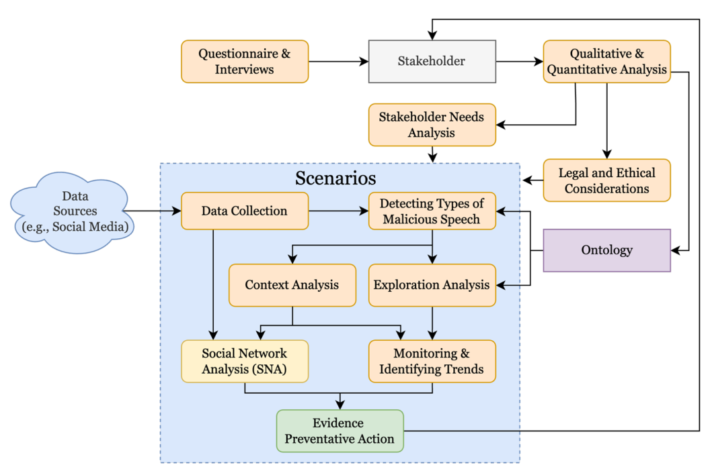
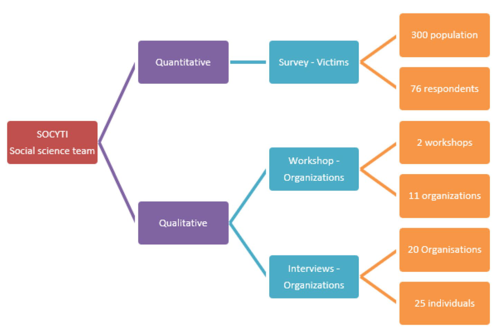

## TL;DR
The main SOCYTI journal paper. A **participatory-design** study of Norwegian hate-speech **victims** (survey, n = 71) and **responders** (25 people from 20 organizations) identifies four needs: emotional support, awareness, legal clarity and technology. These feed a **conceptual multilingual, multimodal AI framework** for hate-speech **investigation** and **prevention**: detection, exploration, social network analysis and trend monitoring, an ontology and knowledge graph, continual model adaptation and explainable AI, under explicit legal and ethical safeguards.

## Problem
Online hate speech harms individuals and community cohesion. It is ambiguous, culturally specific and evolving; only about 7% of content is hateful; labelled data is mostly English; and moderation tools ignore stakeholders' needs and rights. Norwegian context and data are especially scarce.

## Approach
- **Theory:** Stakeholder theory, participatory design, socio-technical theory, and the NIST AI Risk Management Framework.
- **Methods** (Fig. 1): the SOCYTI social-science team ran a **victim survey** (about 300 reached, 71 responses; purposive and snowball sampling through advocacy groups) and **responder workshops (2) and interviews (20)** with 25 individuals from 20 organizations (municipalities, Konfliktrådet, NGOs, police, a NATO advisor).
- **Framework** (Fig. 3):
  - questionnaires and interviews → stakeholder needs → legal and ethical considerations → ontology;
  - scenarios: **data collection → detecting types of malicious speech → context analysis and exploration analysis → social network analysis and trend monitoring → evidence and preventive action.**
- **Scenarios**: (1) **HS investigation**: detection and exploration, gathering evidence for case assessment by humans. (2) **HS prevention**: detection and context analysis (SNA, event-linked trends, heat maps) to target interventions.
- **Technical components**:
  - transformer-based binary and multiclass detection;
  - target labels: potentially hateful, offensive or abusive, and neutral;
  - **15k English/Norwegian tweets** collected, with 1,500 expert-labelled and the rest weakly labelled;
  - plans for Mastodon, Bluesky and Reddit data, and multimodal data;
  - SNA with community detection;
  - an **ontology-guided knowledge graph** queried with SPARQL or natural language;
  - **continual adaptation** (drift detection with DDM/EDDM, defenses against catastrophic forgetting);
  - **XAI** (SHAP, LIME);
  - human-in-the-loop review, GDPR, EU AI Act, ethical and data-protection impact assessments.

*Fig. 3: Stakeholder inputs → needs and legal/ethical analysis → ontology → scenario pipeline (data collection → detection → context and exploration analysis → SNA and trend monitoring → evidence and preventive action).*

*Fig. 1: SOCYTI social-science team: quantitative victim survey (76 respondents shown in the figure; 71 in the text) and qualitative workshops and interviews with organizations.*

## Key findings (stakeholder needs)
- **Emotional and psychological support** (Fig. 2): victims reported anger (43), fear (29), violation (28), shame (27), humiliation (15) and pride in identity (13). Only 25% got help from friends and family, and 14.6% from support groups. Front-line responders from minority backgrounds face secondary trauma.
- **Awareness:** 41 respondents knew of no resources; only 3 knew of legal resources.
- **Legal and institutional:** only 2 respondents (3%) got help from police. Norway's §185 is vague; platform moderation is retreating (Meta, X).
- **Technology:** responders are overwhelmed by volume and need ML-assisted monitoring; victims need easier reporting.

## Contributions
- A holistic conceptual framework for countering online hate speech grounded in participatory stakeholder-needs analysis.
- Two scenario paths (prevention, investigation) and their components, plus legal and ethical safeguards for deployment.

## Limitations
- Small, self-selected survey sample (n = 71, highly educated, engaged with support networks).
- Conceptual: the system is still being built; no detection results are reported.
