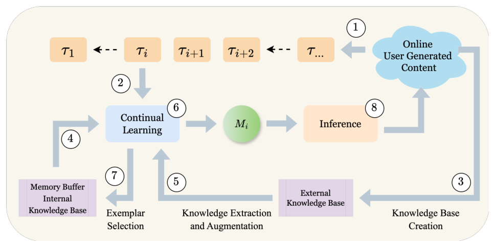
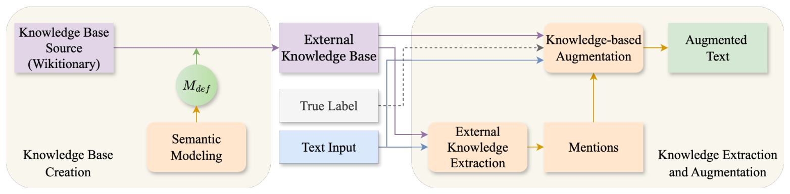

## TL;DR
Replay-based continual learning is limited by a small memory buffer. This paper **augments both the incoming task data (before exemplar selection) and the replayed exemplars (before learning)** using the crowd-sourced **Wiktionary** knowledge graph, with a "semantic" mode that substitutes only senses relevant to hate. Across three hate-speech datasets it greatly improves final accuracy (e.g., HateXplain **16.7% → 46.7%**) and **nearly eliminates forgetting**.

## Problem
Online behaviors such as hate speech drift as events and targets change (e.g., anti-Asian hate during COVID). Fine-tuned classifiers degrade, and updating them causes **catastrophic forgetting**. Replay methods help, but a **fixed-size buffer**, needed for resource and privacy reasons, limits them. External knowledge is barely used in continual learning, and WordNet lacks slang and hate senses.
- **RQ1:** can integrating external knowledge through augmentation reduce forgetting and improve performance?
- **RQ2:** should it be applied at memory sampling, at replay, or both?

## Approach
- **Setting:** class-incremental. Each task is a target-identity domain (religion, gender, race and so on), and labels are task-specific (e.g., gender:hateful) (Eq. 1).
- **Objective:** current-task loss + λ × replay loss, where the replay data comes from both the internal buffer and the external knowledge base (Eqs. 2–3).
- **Framework** (Fig. 2): BERT-base plus an expanding softmax head. The memory buffer holds M = 500 instances split evenly across tasks.
- **Knowledge base** (Fig. 3): Wiktionary converted to triples with Wiktextract (forms, synonyms, hyponyms, instances), chosen over WordNet because it covers slang and evolving language. A trie does fast lexical matching.
- **Semantic modelling:** a SetFit model (all-MiniLM-L6) trained on a definition-level version of HateWiC predicts whether a word sense's definition is hate-related (**80% validation accuracy**). Hateful instances are augmented with hate-related senses, and others with non-hate senses.
- **Augmentation points:**
  1. *Pre-selection:* augment new-task data, then k-means cluster-based exemplar selection.
  2. *Pre-learning:* re-augment buffer exemplars before replay.
  Variants are **KR_rnd** (random replacement, p = 15%) and **KR_sem** (semantic).
- **Baselines:** naive fine-tuning (NF); direct replay with random (RD), stratified (SR) or cluster-based (CS) selection.

*Fig. 2: Task stream → continual learning with memory buffer and external-KB augmentation → model → inference, with exemplar selection and KB refresh.*

*Fig. 3: Wiktionary → knowledge base; mentions extracted from input text; semantic model filters senses; knowledge-based augmentation.*

## Key results
- **Final average performance (Table III, accuracy / AUC %):**
  - D_B (Civil Comments): best baseline SR 65.1 / 83.5 → **KR_sem 76.2 / 85.8**.
  - D_H (HateXplain): best baseline 16.7 / 57.2 → **KR_sem 46.7 / 63.4** (KR_rnd 63.5 AUC).
  - D_K (Kennedy): best baseline 27.8 / 70.5 → **KR_sem 43.4 / 73.7** (KR_rnd 74.3 AUC).
- **Forgetting (Table IV, accuracy-based F_A, lower is better):**
  - D_B: 15.9–17.3 → **3.5**
  - D_H: about 31 → **0.7**
  - D_K: about 35 → **13.4** (KR_rnd)
  - Naive fine-tuning forgets up to 77.3.
- **Ablation (Table V):** dropping *pre-learning* augmentation hurts most (D_H accuracy 46.7 → 16.9). Dropping *pre-selection* augmentation hurts a little. Both stages help, which answers RQ2.
- KR_sem beats KR_rnd only marginally: few words in a message are hate-relevant, and semantic mode yields fewer augmentations (Fig. 5). t-SNE shows much more task-discriminative features than the baseline (Fig. 6).
- Cluster-based selection (CS) did *not* beat random selection, contrary to prior work.

## Contributions
1. An extensible framework for integrating **external** knowledge into continual learning for text classification (prior work used only internal knowledge).
2. Addressing evolving online behavior for behavioral analytics systems.
3. Extensive evaluation with ablation.
4. Public release of augmented knowledge bases, models, code and processed data.

## Limitations & future work
- Knowledge enters only through augmentation, not as features or constraints.
- Tasks are split only by identity group; English only.
- Wiktionary is volunteer-curated (ConceptNet and multiple knowledge bases are future work).
- Augmentation adds computational overhead.
