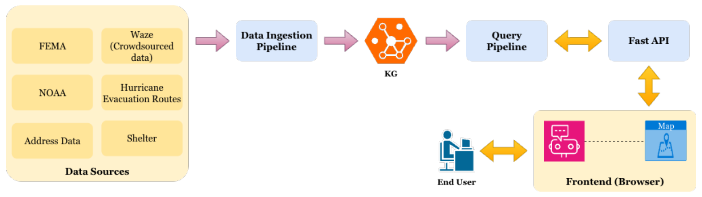
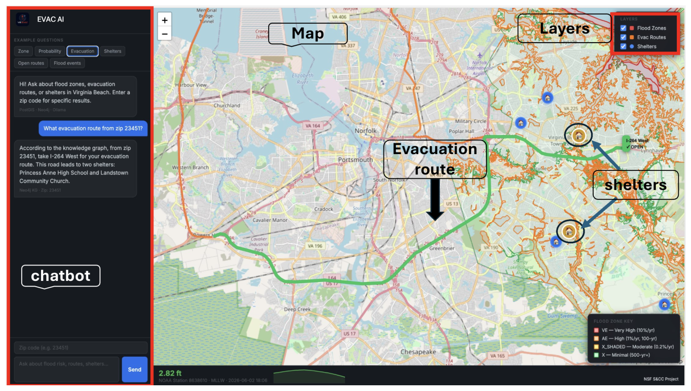

## TL;DR
Coastal flood risk is limited less by missing data than by **fragmented** data across agencies, formats and update rates. **EVAC-AI** fuses six Virginia Beach sources (FEMA, NOAA, the city, Waze) into one **Neo4j knowledge graph**. A local-LLM **natural-language-to-Cypher** pipeline with validation, repair and expert fallbacks answers resident and manager questions in a chatbot plus map. The paper frames the requirements as **integrate, optimize and coordinate**.

## Problem
In regions like Hampton Roads, Virginia, hazard, infrastructure and vulnerability data sit in separate agency silos, so compound flood risk can't be assessed as one picture during response planning. Three capabilities are needed:
1. **Integrate** heterogeneous sources into one queryable representation.
2. **Optimize** decisions by reasoning across interconnected layers (flood zones, roads, shelters).
3. **Coordinate** role-specific access for residents and emergency managers from one shared source.

Earlier KG and RAG systems either didn't integrate agency-specific live sources or were judged only on single-answer correctness.

## Approach
- **Data** (Table 1): six 2024 sources with no shared schema, updating from every 6 minutes to static. Evacuation routes and Waze flood reports were shared privately by the City of Virginia Beach; shelters are synthetic.
- **Ingestion:** address points spatially joined to FEMA flood polygons and aggregated to ZIP codes (dominant and present zones); NOAA water levels above the flood threshold grouped into events and graded by severity.
- **Knowledge graph:** Neo4j with 6 node types (e.g., Location, FloodZone, EvacRoute, Shelter) and 6 relationship types (e.g., IS_IN_FLOODZONE, NEAREST_EVAC_ROUTE, LEADS_TO_SHELTER).
- **Query pipeline:** intent detection → local **qwen2.5-coder** generates Cypher using the schema → **Chase & Backchase repair** and validation → expert-template fallback if needed → local **llama3.1** writes the answer **only from returned records**.
- **Design choice:** direct KG-grounded querying instead of KG-RAG summarization, which keeps graph structure, gives auditable multi-hop traversals, and lets every role be answered from the same verifiable records.
- **Interface:** FastAPI backend; a Leaflet single-page app with chatbot and map, where answers come with map actions (Fig. 2).

*Fig. 1: Data sources (FEMA, NOAA, Waze, routes, addresses, shelters) → ingestion → KG → query pipeline → FastAPI → frontend for end users.*

*Fig. 2: Chatbot plus map. "What evacuation route from ZIP 23451?" returns I-264 West and two shelters, highlighted over flood zones.*

## Key results
- A working prototype for Virginia Beach. **No quantitative evaluation** yet; the paper presents an architecture and a case study.

## Contributions
1. A knowledge graph that integrates heterogeneous flood, infrastructure and crowdsourced data.
2. A natural-language query pipeline producing validated, schema-refined Cypher queries for cross-system retrieval and role-specific coordination.

## Limitations & future work
- One city, 2024 data only, synthetic shelters, a single interface (coordination only partly realized).
- Not yet evaluated with residents or emergency managers.
- Future work: role-specific views, more live agency feeds, other regions and hazards, ablations of the NLP components.
