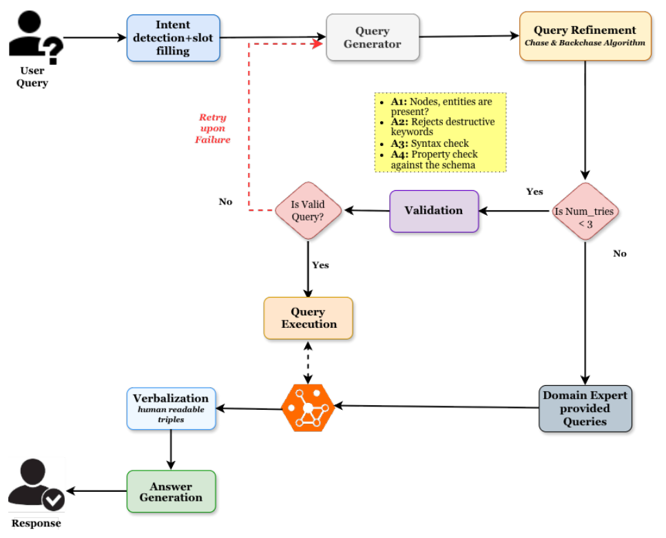
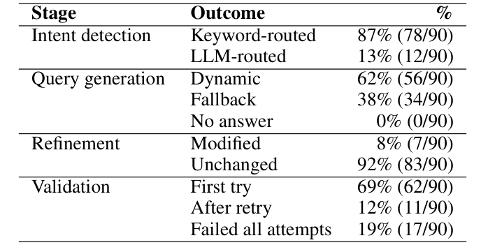

## TL;DR
**RISE** is a knowledge-graph question-answering system deployed for the **June 2026 Venezuela M7.5 earthquake**. It is evaluated two ways on the same 30 questions: a **stage-wise pipeline trace** and an **LLM-as-a-judge** answer rating. Each view alone looks good: every question is answered, 87% are keyword-routed, and judge scores exceed 4/5. Read together, they show that **fluent, well-grounded answers can mask wrong intent routing and fallback answers to a different question**.

## Problem
KG question answering promises to turn scattered disaster data (satellite damage, infrastructure, hazard zones) into answers for coordinators. Standard evaluations check whether the right data was retrieved (execution accuracy) or whether the text matches its evidence (LLM judges). Neither checks whether the answer addresses the **question actually asked**. For responsible AI in disasters, a confidently wrong answer can misdirect response.

## Approach
- **Knowledge graph** (Neo4j): building damage stored **separately per source** (radar confidence vs. optical severity) to keep provenance; pre-event OpenStreetMap baseline; UNEP/OCHA hazardous sites; USGS shaking zones; OCHA states and municipalities. SOURCED_FROM and LOCATED_IN edges at every administrative level.
- **Design principles:** source provenance, scope enforcement (no casualties, shelters, utilities or agency information), and **local inference** through Ollama for low connectivity and data residency.
- **Pipeline** (Fig. 1):
  1. ordered keyword intent rules with llama3.1 as fallback;
  2. qwen2.5-coder (1.5B) Cypher generation with schema and exemplars;
  3. Chase & Backchase refinement;
  4. validation of labels, destructive keywords, property keys and EXPLAIN, with up to 3 retries;
  5. execution with **expert fallback templates**;
  6. verbalization into triples;
  7. constrained answer generation.
- **Evaluation:**
  - 30 gold questions over 8 intents, including 3 deliberately out-of-scope (Table 1).
  - **Study 1:** each question run 3 times (90 runs), recording per-stage outcomes (Table 2).
  - **Study 2:** five 1–5 criteria (helpfulness, clarity, evidence grounding, appropriateness, reasoning support; Table 3). Judges see the retrieved records; the generator model is excluded as a judge; judges were validated on probe answers (accurate, hallucinated, vague, correct refusal).

*Fig. 1: User query → intent and slot filling → query generation → Chase & Backchase refinement → validation (A1–A4, retry under 3) → execution or expert fallback → verbalization → answer.*

## Key results
- **Study 1 (Table 4, 90 runs):**
  - **Every run answered** (an earlier version left 25% empty because exemplars referenced non-existent properties).
  - Query generation: **62% dynamic, 38% fallback**. Of the 34 fallbacks, 17 never passed validation and 17 were valid queries that returned no rows.
  - Validation: 69% passed first try, 12% after retry, 19% failed.
  - **6 of 30 questions flip** between dynamic and fallback across identical runs (non-determinism of the 1.5B model); 8 always fall back, including all 3 out-of-scope questions.
  - **Intent errors:** five intents at 100%, but area_summary 33% and education_impact 67%. All errors come from the *earthquake* keyword rule firing first.
- **Study 2 (Table 5)**, gpt-oss-120b / Gemini 3.1 Flash Lite: clarity **4.70 / 4.83**, evidence grounding 4.33 / 4.13, appropriateness 4.03 / 4.43, helpfulness 3.73 / 4.17, reasoning support **3.67 / 4.13** (lowest). The judges agree within one point 87–97% of the time.
- **Joint analysis:** no reliable quality difference between dynamic and fallback answers (−0.07 / −0.21; underpowered).
- **Lessons:**
  1. *One word, two roles:* "earthquake" is sometimes the information need and sometimes just context, and keyword rules can't tell which.
  2. *Grounded language is not a grounded answer:* fallback answers at the wrong administrative level still score high on grounding and appropriateness, because the rubric checks text against evidence, not against the question.

*Table 4: Outcomes for intent detection, query generation, refinement and validation over 90 runs.*

## Contributions
1. RISE, a KG-grounded QA system combining independent damage assessments with pre-disaster infrastructure and administrative geography, behind a seven-stage NL-to-Cypher pipeline.
2. A two-axis evaluation method (stage-wise trace plus LLM-as-a-judge) that exposes failures neither axis finds alone.
3. Evidence that responsible evaluation of disaster QA needs this paired instrumentation, because fluent and grounded is not the same as correct.
